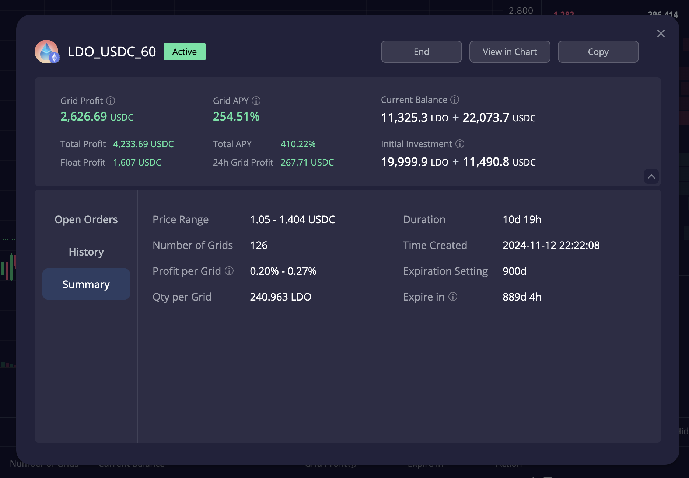
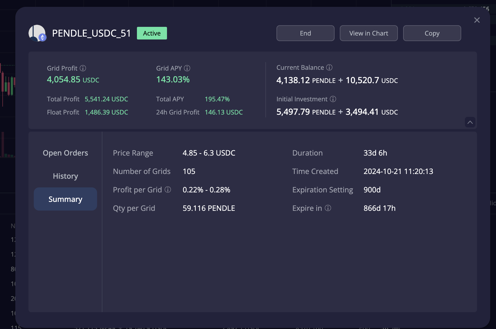
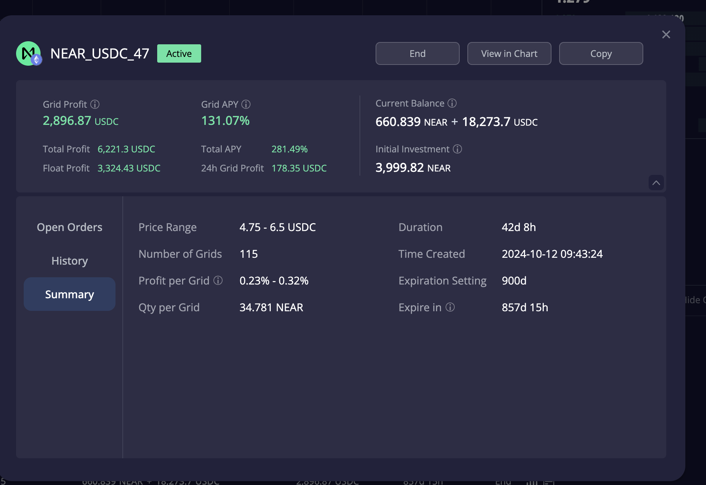
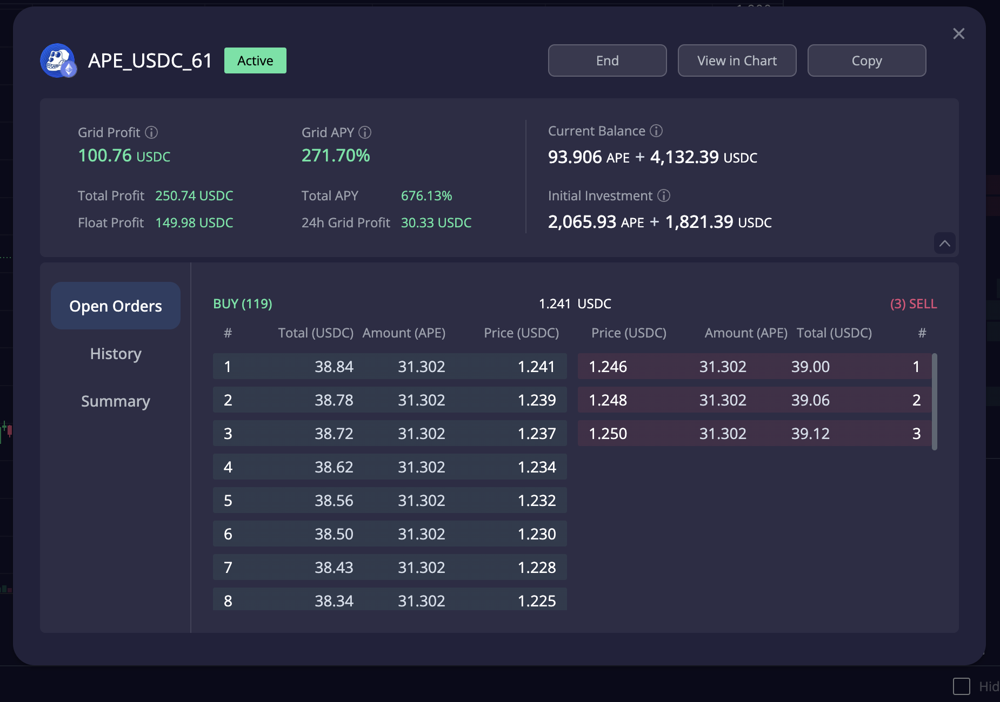
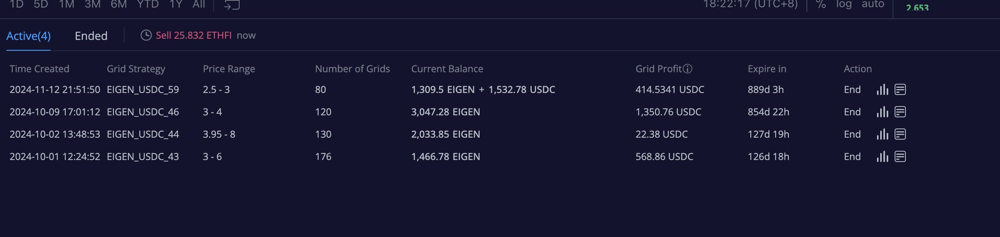
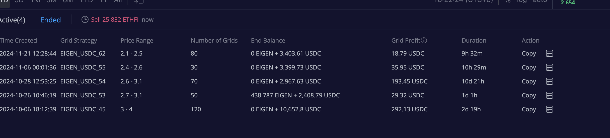
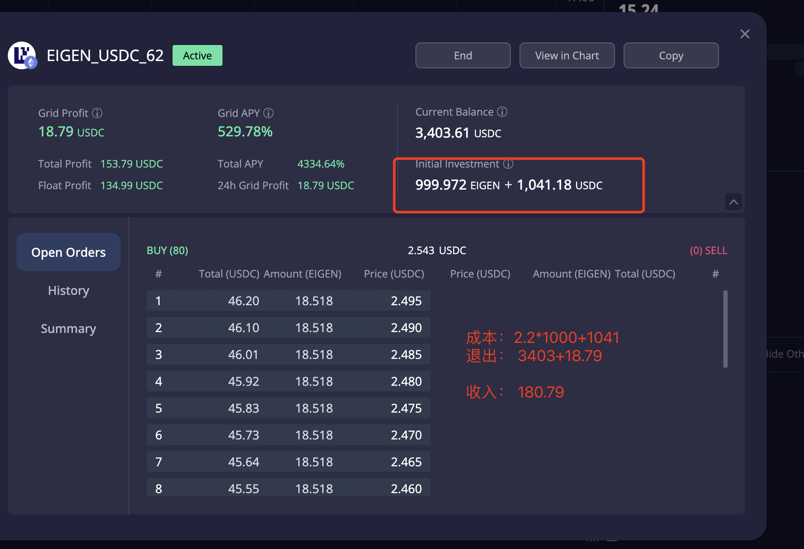

# 加密货币投资周刊 第1期

_本文写于2024年11月23日下午_

大家好,我是FatPro - 一位专注于让钱包变胖的资深投资者。
在过去多年的投资生涯中,我有幸在市场的跌宕起伏中收获了不错的战绩。正是这些真实的经历让我更加坚信:"Make Your Wallet Fat"不是一句空话,而是每个人都可以通过正确的方法实现的目标。
作为一个经历过至少三个牛熊周期的投资人,我深知投资既是科学也是艺术。在这个栏目里,我会用接地气的视角,将我多年积累的投资心得和实战经验毫无保留地分享给大家。
这里不会有华而不实的理论,只有最真实的市场感悟和实战技巧。让我们一起在投资的道路上稳步前行,实现财富的持续增长。

## 我的投资理念

在加密货币市场中,很多投资者往往陷入追涨杀跌的误区,在建仓一个资产时没有做整体的规划，随机的去持有各种资产，最终损失惨重。本专栏旨在帮助投资者建立科学的投资理念,掌握稳健的投资策略。

我的个人投资核心理念是:

1. 自动化投资 - 利用机器人工具,避免人为情绪干扰，增加日常被动收入
2. 不断降低持币成本 - 通过定投、网格、波段等策略持续降低持币成本，部分实现零成本
3. 去中心化优先 - 远离中心化平台长期存币的风险,使用自托管和去信任的服务
4. 复利增长 - 用稳定收益再投资获取超额回报，收益部分积极的投资高风险资产和策略
5. 不做纯杠杆投机 - 杠杆工具只用于某些特定的对冲策略和套利策略

## 市场周报

### 上周市场综述

本周市场BTC创出了新高，接近了10w美元的大关，在资本市场上以ETF为首的入口传统资金正在不断进入加密市场。周中SOL也创出了新高。本周ETH继续震荡，创出了相对于BTC汇率的阶段性低点0.0318，之后ETH也有了一些相比前面几周较为强势的反弹，XRP和XLM因为川普上台和Gensler确认离职后，解除了之前的不利消息，开始强劲拉升，DOGE持续走热，直到周五周六前期滞涨的二线公链纷纷开始了表演，ADA,ATOM,DOT，AVAX, NEAR, AR, ICP均有不错的表现。感受到一个热情洋溢的牛市正在缓缓拉开序幕。

牛市多扎针，大家要控制风险，不要盲目追高，不要过度杠杆。适当的进行一些顶背离明显币种的波段操作，增加收益，大胆的去改善生活，释放熊市被压抑的消费欲望:）
相信BTC价格突破后，很多的alt coin会进行一轮补涨，选择基本面向好，反弹力度还不大的币种，可以适当参与。

### 上周个人网格投资回顾 

#### LDO网格

运行了10d19h，区间1.05-1.404， 网格APY到达了 254%，每24小时大约有250-350美元的收益，至今已经产生了2600美元的收益。这个LDO策略是当时1.1美元的时候买入20000枚LDO并开设的，我认为LDO的波动稳健，没有上蹿下跳快速出格的可能性，是一个很不错的策略。

#### PENDLE网格
这是一个我早起开设的SELL HIGH pendle的网格，因为这些pendle都是我低价购买，上涨后已经基本到达了我的出货预期，所以我大约在pendle价格4.5左右开设了一个【4.85-6.3】区间的网格，也就是低于4.85不卖，目前网格APY大约在140%左右，每24小时大约有100-200美元的收益，虽然只有一部分时间进格，但至今33天已经产生了4000美元的网格额外收益。可以关注到这个策略本金只有30000美元，实际上1个月已经赚取了超过10%的本金，表现十分强劲。

#### NEAR网格
我是一个长期Near持有者，大的仓位是在Near做原生的Staking，历时几年的Near持仓和网格已经让我的Near资产的成本趋近于0，定期取出一部分Near进行Sell High的网格操作去增强收益，也让我养成了定期变现的习惯，不让一个资产在那里无尽的躺下去。这个Near网格区间是【4.75-6.5】，42d APY在131%，也是因为是Sell High的缘故，可以看到初始资金是4000个Near，也就是意味着我没有投入任何一个USDC，为了就是去出货，在这一轮上涨的过程中，既帮我拿住了币没有早早的出掉，也帮我斩获了2900美元的额外收益，下周这个策略的表现敬请期待。

#### APE网格
我是一个APE质押挖矿者，我用BAYC和MAYC组合质押可以活动APE本位年化50%的收益，也就是我每个月有几千枚APE的收益，我的策略是每月claim一次APE收益后进行看多网格。这个网格开设3d，区间【0.97-1.25】，开设时价位应该在1.1左右，呈现出的是即将出格的状态，因为我本来就要卖出，如果出上轨，我会选择关闭这个网格，那我的收入即是差价收益叠加网格收益。现在APY在270%，已经3d赚取了100美元的收入。

#### EIGEN网格
EIGEN因为是一个空投资产，但是我长期还是较为看好的，我不是十分想卖，想长期持有这个资产。所以领到空投之后开设了一个 3.95-8的网格企图去接触新币发行的影响力做一个高位震荡收益，但是没有取得很好的效果，不过其后EIGEN进入了3-4的甜蜜震荡期，期间我开设了多个网格获得了不错的收益，但是因为EIEGN是一个空投资产，早期一直会有抛压，那么价格有下行风险，那么设置较低位的保护单来保护出格之后进一步降低平均持币成本是很关键的，那么实际上我在这个过程中开设了很多个保护单并且做了很多次有效的波段和网格去降低平均持有EIGEN的成本。

具体举个例子
以下是一个跌传2.5后我在2.2吃到1000枚EIGEN保护单后反手开的一个2.1-2.5的网格，虽然EIGEN进行了快速的反弹，这个网格只持续了9个小时，但是因为有保护单的存在让我在这次波段中也赚取了180U的收益，对整体降低我的网格持币成本有很大帮助，此时我的2.5-3的网格其实又到了甜蜜区间，重新开始产生收益。

### 下周操作推荐
- 本周我认为会市场会有较大幅度的震荡，一方面是前期未涨资产的补涨需求，也许可以关注ETH在新一周的表现。
- 针对前期已经有不错获利的资产的朋友，可以适当的尝试在高位卖出一部分资产变成USD，组装成一个中性策略+-20%的网格，使得资产在新的平台期获得波动收益，如果市场大幅回调，那么你会在过程中买回之前所卖出的代币，相当于获得了网格收益+波段收益。如果持续震荡上涨，则整体增强获利离场。
- 对于低估类的资产，仍然是一个很好的换仓时刻，将已经收益较大的资产切换一部分至未涨资产可以有效的控制回撤，并增加整体收益的可能性。比如持有BTC的可以尝试切换一部分为ETH。 

### 其他策略机会分享
我近期参加了以太坊的Devcon，以太坊社区的创业热情和技术创新仍然令人印象深刻，以太坊生态的繁荣发展，为区块链技术的发展提供了强大的动力。大家可以通过这个视频了解以太坊生态的最新roadmap.
https://www.youtube.com/watch?v=8mJDt8TGebc

因此，我也在寻找一些以太坊系低洼的机会，信息还未被大众所关注，但未来可能会有不错表现。

第一个: 被社区所诟病的以太坊Rollup战略导致的流动性割裂问题，虽然社区提出了很多的解法，shared sequencer, intent等. 但我个人认为Based Rollup+preconfirmation在技术上也许是最优雅的一种解法，既用onchain的方式解决问题，也能够增加以太坊的经济模型的完整性。但是推进仍然有一些阻力，我也在这个过程中发现了一个long shot投资机会，比如Puffer，作为这个赛道不多的几个尝试者，估值不到300M，市值小于30M，可以作为是ETH的一个杠杆资产，如果Based Rollup有所突破，Puffer的市值可以有不错的增长。可以当前价0.28左右买入拟买入的50%仓位，预计下跌空间不会超过30%，可设置每跌15%再加仓25%的策略进行

另一个：我认为LDO的估值和基本面是背离的，原因应该是受到了SEC关于Consensys的诉讼的影响，但是Lido作为以太坊生态的流动性提供者，在以太坊生态中扮演着极其重要的角色，随着SEC换将，川普的上台，在下一个周期很有可能会促成诉讼的解决，Lido的估值应该会回归到正常水平。另外，Staked ETF中期来讲是以太坊吸引主流资金进入的发动机，Lido作为Staked ETH的流动性提供者，应该会持续受益。可以当前价买入LDO，并开设当前价-15%至+30%的网格，再用收益复投LDO是一个很不错的策略。

### 每周一个小Tips

如何选择用于开设网格的资产？
- 选择优质资产，即使向下出格你仍然有意愿去长期持有的资产
- 选择波动性较好的资产，最好有多空立场差

篇幅有限，后续我会做一整套从资产选择，时机选择，策略选择，网格的其他投资策略中作用的讲解视频，敬请期待。

### FAQ
网格是不是不如一直持有现货赚的多？
- 网格策略是利用波动性获取收益，而持有现货是判断趋势，在趋势中赚取收益。两者没有绝对的优劣，只是适合不同的市场环境和交易习惯。但是市场总是在震荡的，你经常会有一个感觉，就是买了一个币希望他涨，但是却一直徘徊上不去，所以网格策略在震荡市中往往能够获得不错的收益，日常收益会让漫长的等待变得很舒服，假设一个策略年化200%，我的很多策略至少是200%，那么实际上你可以算出来只要这个策略不算复利的情况下能够坚持180天，那么所有的币已经是0成本了，算上复利时间更短。
- 你总是把握不住最佳卖点，这是常态！网格给你一个提前强制规划投资计划的习惯，让你在牛市中不会因为贪婪而错过卖点，在熊市中不会因为恐慌而错过买点，而不再是一种随机性很强的投资习惯，我买入一个币，我为什么买，什么时候应该卖，目标是什么，漫无目的的投资就像是毒品，久而久之你持有一堆资产，而总是觉得自己没有赚到钱。

### 工具选择
网格策略会使用去中心化交易所DeGate进行交易,https://degate.com/
DeGate是基于零知识证明的订单薄DEX，具有用户在自托管前提下，提供接近中心化交易所的交易体验，并且Maker免费的特点对于网格用户极其友好。

### 社群交流
欢迎关注我们的社群,与其他投资者交流经验:
- Discord:

免责声明：本人不是专业的理财顾问。以上内容仅代表个人观点和经验分享，不构成任何投资建议。投资有风险，入市需谨慎。所有投资决策请根据自身情况独立判断，风险自负
