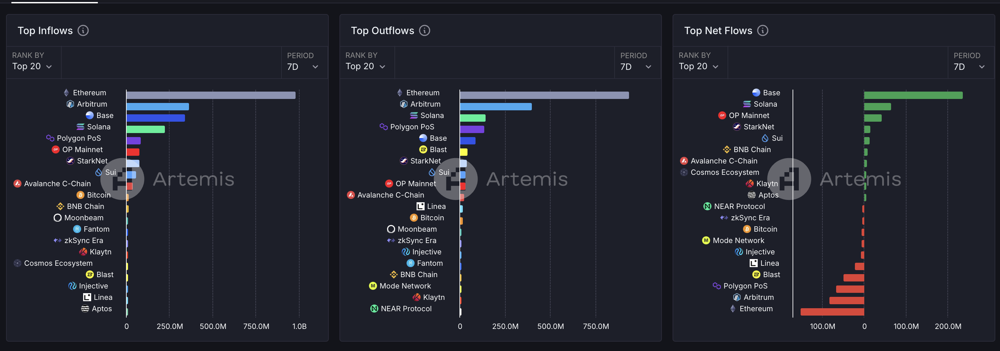
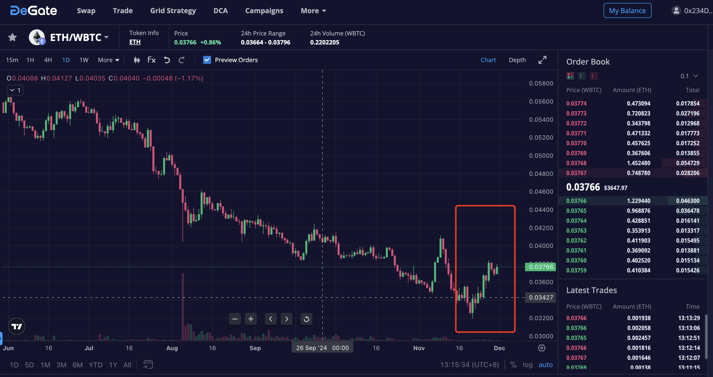
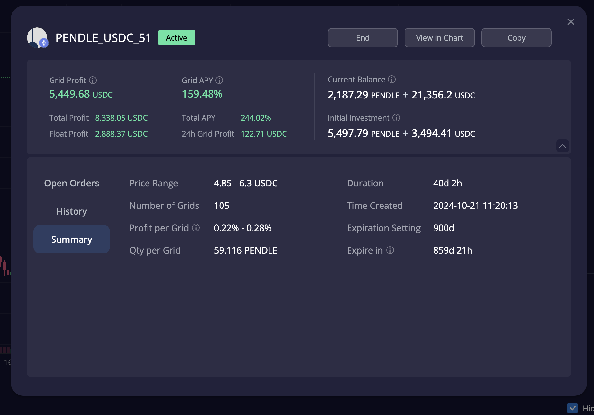
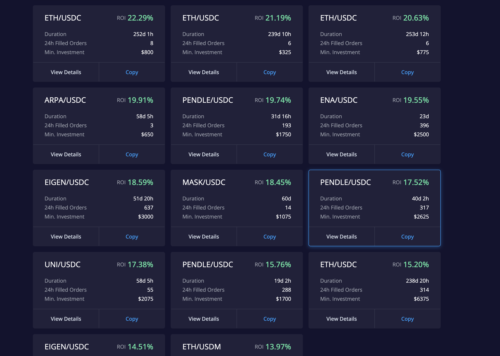
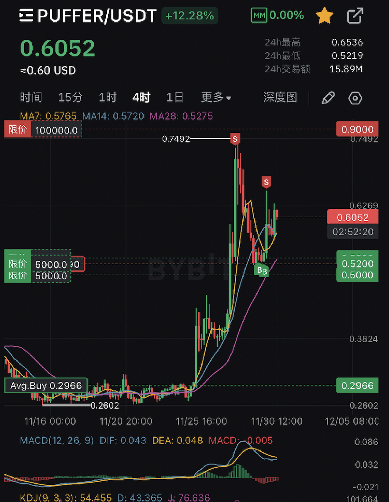
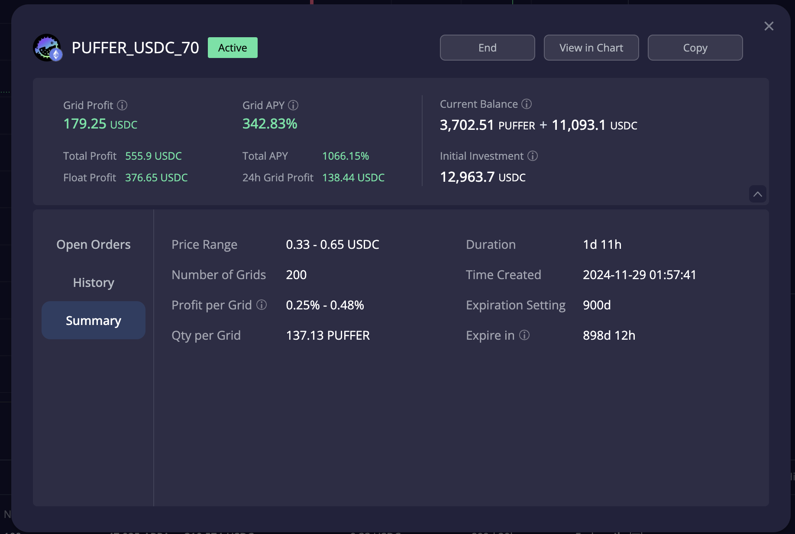
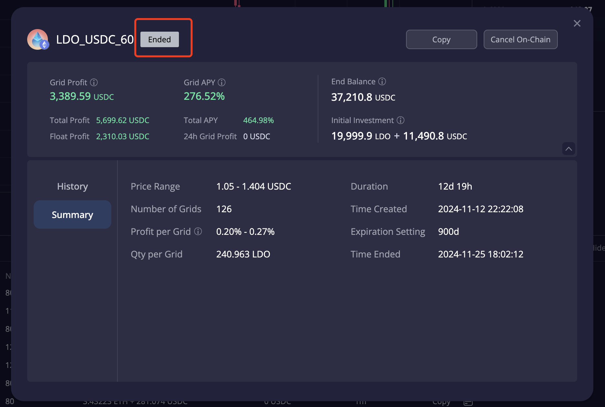
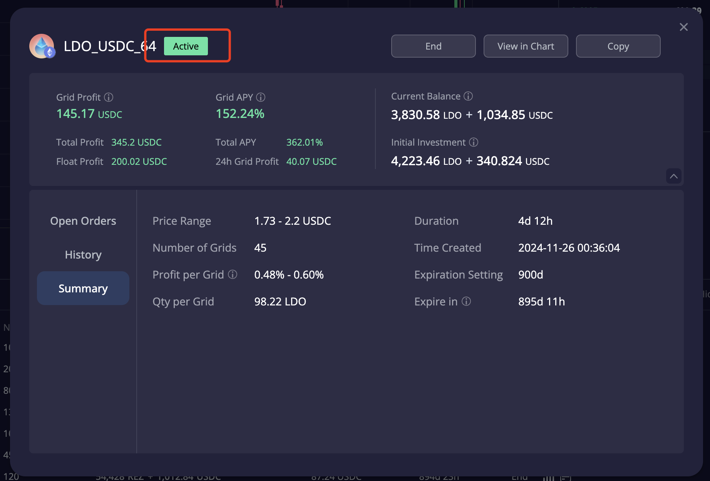
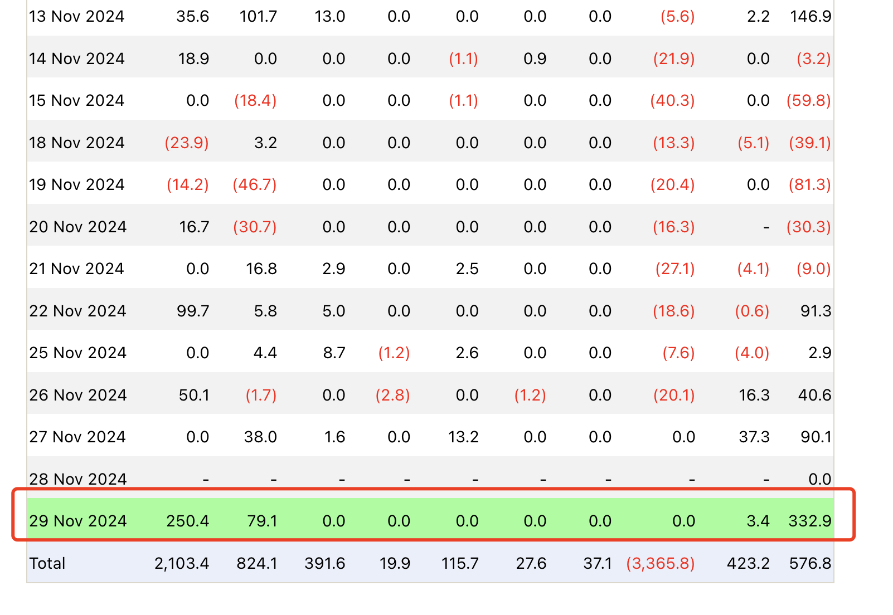
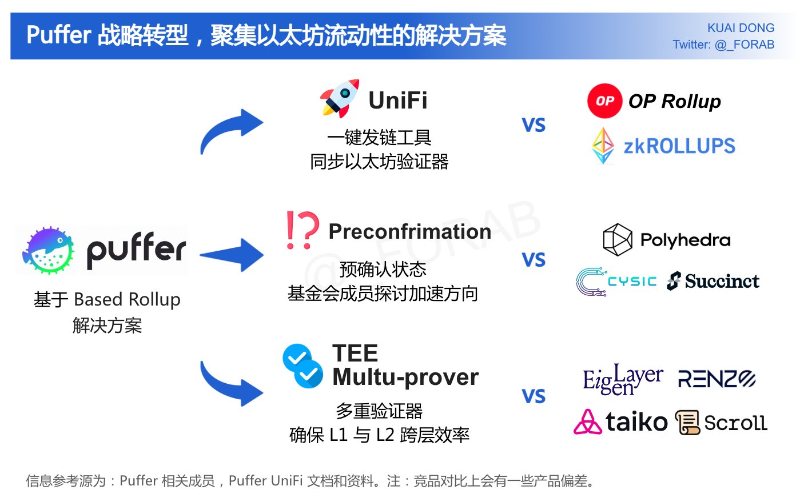

# 加密货币投资周刊 第2期

_本文写于2024年11月30日下午_

山寨牛来啦！大家好,我是FatBro - 一位专注于让钱包变胖的资深投资者，这是我的第二期加密货币投资周刊。

我们终于迎来了以太坊生态的全面反攻，绝对是热情洋溢，朝气蓬勃的一周。在这一周里，以太坊生态的龙头项目都出现了可观的涨幅，从以太坊ETF的数据和稳定币发行量来看，资金流入以太坊生态的的迹象非常明显和坚决。从资金流入流出数据看，本周出现了一个很值得分享的现象，以太坊及Base生态的资金量流入远超其他生态，是Solana的4倍左右，可见以太坊的反击正在拉开序幕。

话不多说，我先带大家回顾一下上周周刊中的操作建议和实际成果。

### 上期预测回顾

在上一期周刊中，我们做出了以下几个关键预测和建议：

#### 1. ETH表现预期
   - 上周预测：ETH将在新一周有较好表现，可能出现补涨行情，建议BTC部分仓位切换至ETH
   - 实际效果：过去一周BTC在破新高后暂时停止了进击的脚步，ETH/BTC在触底后出现了较大幅度的反弹，ETH单周涨幅我认为接下去ETH相对于BTC仍然还会有一些上涨空间，但是也许并不会发生的很快，同时BTC也有进一步突破新高的需求，所以这个位置我认为会发生一些反复拉扯的震荡波动，如果你主流币仓位过少，也许将前期获利较大的MEME和Alt coin变现后去开设一个ETH/WBTC的网格也许是不错的选择，一方面帮助你锁定利润做整体仓位的再平衡，另一方面获得网格的增强收益。
      

   ##### 仓位再平衡的知识点 补充
   每个人在建立自己投资风格的时候应该都考虑过仓位再平衡的问题，但是可能很多人都没有意识到仓位再平衡的重要性。投资仓位再平衡是一种投资策略，用于在投资组合中调整各资产类别的比例，使其与最初设定的目标比例相符。比例的设置取决于个人的风险承受能力、投资目标和市场预期。比如你可以设置主流币和山寨币的比例为70%和30%，那么当主流币上涨30%，但是山寨币不变时，你可以将主流币卖出21%，将山寨币买入21%，这样你的仓位比例就回到了70%和30%，这样就完成了一次仓位再平衡，这样的思考会让你去思考你投资组合中各资产类别的比例是否合理，是否需要进行调整。当然你可以设置更复杂类别关系，比如BTC，ETH生态，二线公链，山寨币，MEME，AI赛道等等。如果你有其他的投资，比如债券，股票，房产，那么你也可以设置这些资产和加密货币的比例，这样可以帮助你控制风险，获得更好的投资回报。

#### 2. 高位资产策略建议
   - 上周建议：对已获利资产采用±20%中性网格策略
   - 实际效果： 对我来说这个资产就是Pendle，在这周一直在5-6区间内波动，我的这个40d赚取5500U的策略依旧在持续产生收益。也很开心这个策略也进入了DeGate的推荐策略榜。但是我认为这一轮以太坊生态币的上涨中Pendle涨幅不大，虽然是很好的网格资产，但是我的现货持有部分在突破6时，我会去考虑做再平衡，换成其他的资产，期待下周和大家分享实际的操作结果。
     
   
   

#### 3. 特别推荐项目
   - 上周建议: Puffer (0.28美元价位买入建议)
   - 实际：实在是运气太好，0.28买入后居然Based Rollup赛道在市场上发酵，周中也上了韩国交易所，价格直接最高到了0.7，我陆续做了一些波段和网格，整体一周大约获得了3倍左右的收益，已经出了本金和一仍然持有1/3的仓位，后续一部分进行网格，一部分挂在1美元左右的位置等待二次起飞,因为对于Based Rollup的长期发展我还是比较看好的，并且还有一个机会是Puffer是binance lab投资但是还没有list binance的项目之一。
     
   
   
   
   - 上周建议: LDO (-15%至+30%网格策略建议)
   - 实际：我的LDO网格在这一周成功出格，没有了原先策略的网格收益，但是我是从1.1建仓开始所产生的网格收益，一直都进行着复利再投资LDO，所以我将积累4000多枚LDO又重新开设了一个sell high的网格。同时，LDO的政策面和基本面都没有变，继续同时持有现货仓位和网格策略。
   
   

### 下周市场展望

- 以太坊生态极有可能成为最靓的仔，11月的最后一个感恩节半天交易日，ETF的流入惊为天人，达到了前所未有的332M，传统资金显然已经坐不住了，如果下周以太坊生态继续保持强势，那么以太坊生态的龙头项目，二层将会有不错的表现。

- 上周的Based Rollup赛道推荐后，我今天也想向大家介绍另外一个可能被低估的赛道，也就是ZK STACK。众所周知，以太坊二层生态中以Op Stack和Arbitrum Stack为首的生态项目占据了大多数TVL和用户，但是ZK Stack作为以太坊生态的另一条技术路线，在经历了漫长的熊市后，目前仍然处于较低的估值水平，但是随着ZK技术的不断发展和应用生态的adoption，ZK Stack的潜力正在逐渐被市场所认识。
以太坊Beam Chain路线图中对于ZK技术的大幅度采用，使得zk的技术从长远看有延续性和终局性。ZK的二层在用户资金退出的体验上相比Optimism Rollup是更优的。如果叙事存在，本次牛市中ZK系对于OP系的反击也许是一个很大的alpha！

目前以太坊生态中，我认为Layer2 中有Stack能力(指生态级别可以被其他链开发者拓展使用的软件包)的一共有4个大板块和其他几个中型项目，分别是:

### 四大L2 Stack对比

| Stack名称 | 技术类型 | 代币 | FDV (完全稀释估值) |
|----------|---------|----------|-------------------|
| Op Stack (Superchain) | Optimistic Rollup | OP | 约100亿美元 |
| Arbitrum Orbit | Optimistic Rollup | ARB | 约95亿美元 |
| zkSync Elastic | ZK Rollup | ZK | 约39亿美元 |
| Polygon Arrglayer | ZK Rollup | Matic | 约58亿美元 |

在这几个Stack中，我认为zkSync Elastic是其中最有潜力的一个
- TVL在zk系目前排名第一但估值最低
- ZK在熊市表现的非常克制，并没有像很多项目一样把大量的激励浪费在了错误的时间单，当前，依托牛市热度，社区正在投票进行激励计划，如果顺利，ZK的牛市表现值得期待。

除此之外，Puffer的Unifi正在打造的Based Rollup Stack令我印象深刻，这里借用好友 AB的推特threads给大家做更系统的介绍，如果实现，绝对是低估中的低估 https://twitter.com/_FORAB/status/1854876348487287060

还有一些其他的ZK系项目也可以关注，如Starknet，Taiko，当然还有 DeGate:)

### 工具选择
网格策略会使用去中心化交易所DeGate进行交易,https://degate.com/
DeGate是基于零知识证明的订单薄DEX，具有用户在自托管前提下，提供接近中心化交易所的交易体验，并且Maker免费的特点对于网格用户极其友好。

### 社群交流
欢迎关注我们的社群,与其他投资者交流经验:
- 电报群: t.me/degate_chinese

免责声明：本人不是专业的理财顾问。以上内容仅代表个人观点和经验分享，不构成任何投资建议。投资有风险，入市需谨慎。所有投资决策请根据自身情况独立判断，风险自负
