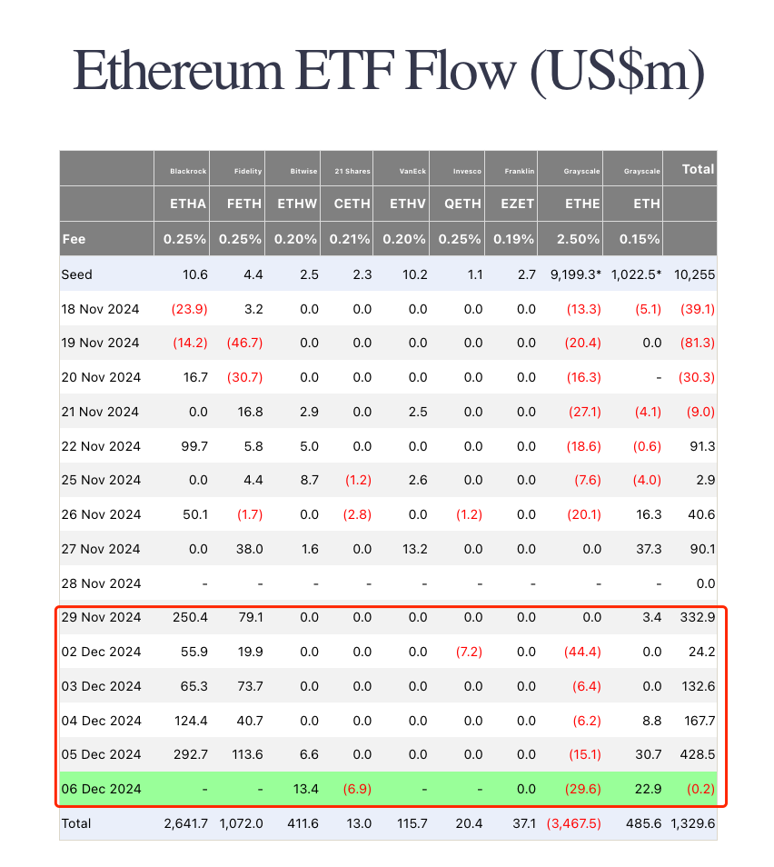
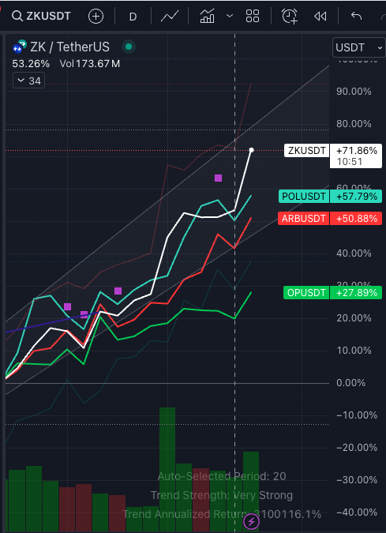
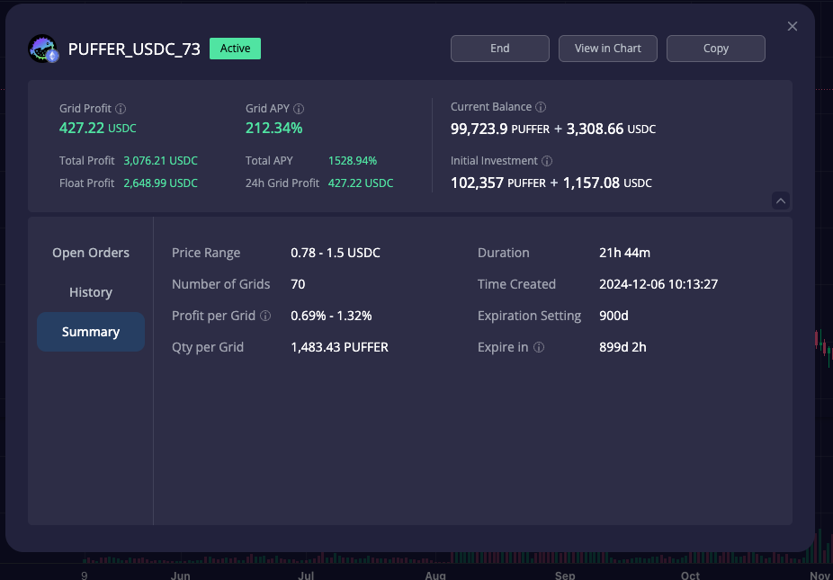
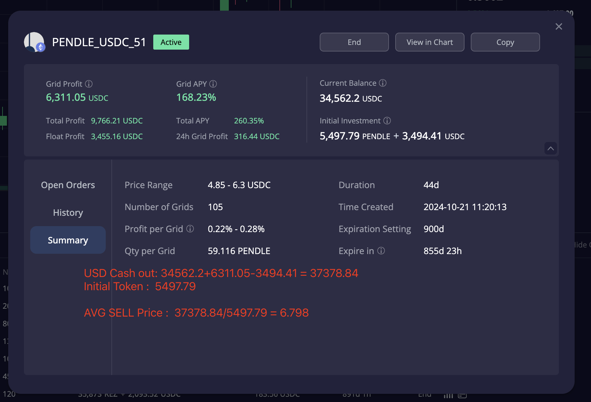
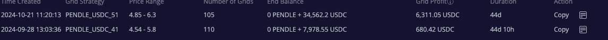
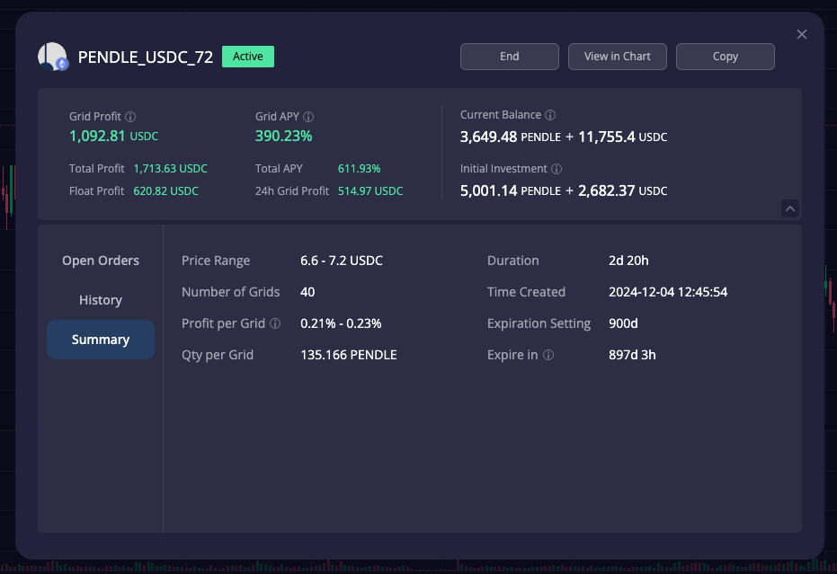

# 加密货币投资周刊 第3期

_本文写于2024年12月7日上午_

突破进行时！大家好,我是FatBro - 一位专注于让钱包变胖的资深投资者，这是我的第三期加密货币投资周刊。

牛市进展的比我预想中的还要迅速，本周BTC突破了10w美元的新高。ETH整个生态像是集团军作战一样，此起彼伏的全面爆发，在周五晚间ETH也站上了4000美元的关键位置, 创下单周ETF流入量的新高。周中也出现了扎针行情，牛市特征明显。

本期FatBro会重点和大家分享一些具体的投资实战经验，重点谈谈牛市如何卖好币，常言道会买的是徒弟，会卖的才是师傅，这个经验越早分享我觉得对大家越有帮助，也欢迎大家留言分享自己的实战经验，一起交流探讨。

## 前情回顾

本周重点话题开始前，先简单的做一下前几期周刊中预测的回顾：

1. 以太坊生态展望
   - 预测：以太坊生态新一周极有可能成为最靓的仔，ETF资金流入强劲
   - 实际：本周创下了单周ETF流入量新高，资金流入强劲，随着BTC连破新高，ETH突破ATH我认为也不会太遥远了。

2. ZK Stack赛道机会
   - 预测：ZK Stack作为被低估赛道有较大发展空间
   - 实际：ZKsync在本周涨幅明显高于其他Op Stack, 产生了强劲的补涨和突破，前期空投盘似乎已经基本换手消化，期待如果能在业务增长的加持下即可长期看好，希望上周读者已经对Zk stack有些布局，期待周期级别的增长机会，好饭不怕晚。
    

3. Puffer的持续爆发
   - 预测：Puffer在0.28点位极具投资价值（第一期）
   - 实际：Puffer在短短的两周中，最高已经触达了0.9美元之上，本周新List了Upbit。维持之前判断，Puffer还有很大持续上涨的动能和空间，不过如果前期已经3倍-4倍获利的读者，可以用三分之一的仓位设置一个0.75-1.5的宽幅网格，逐步兑现利润，扩大战果和降低回撤，也是给自己设置一个退出计划，比如到1.5退出三分之一，如果到3退出另外的三分之一，剩下的三分之一继续持有，等生态发展进一步加速，再考虑是否继续持有。
   下图为我刚刚开设的网格，一天不到已经赚取了427美元的利润，我这里的Puffer的成本位置是0.28，所以这是在当你看好一个币的但又预期继续突破时，可以利用网格扩大收益并进行出货，并且日常的收益给了你复投其他资产的机会，资金效率得到了极大的提升。
   

## 牛市如何卖好币

回到本期的重点话题。这个问题经常会被朋友问到，因为我在过去的几个牛市周期中总能够有不错的处理和退出表现，所以算是有一些发言权。
其实在这个问题上，我没有很多教给大家的绝对技巧，但是能够送给大家的是四个字：**克服人性**

有人常常会说，这个币我牛尾再卖，这个币我要等一等，再等价格最高点，但是任何人没有能力预测什么时候是牛尾，也许牛市就是戛然而止，一两个月结束战斗，你没有反应过来已经入熊，市场的黑天鹅和灰犀牛总是不期而遇，积极的改善生活品质才会让你的投资变得更有意义。

所以， *判断牛市什么时候结束和自己的投资目标不完全挂钩才是卖好币的关键* ，不要在牛市的进行时不断的盲目放大自己的贪婪和目标。比如你要买个房，年初看的老破小，牛市一来，年底不应该改成汤臣一品，看了保时捷不要改成布嘉迪，目标的无节制的放大是卖不好币的罪魁祸首。

那么有没有办法能够更好的管理目标和克服人性呢？
几个心得：
- 在建立一个标的时，尝试给自己建立一个合理的退出目标，而不是随机的去持有任何资产，不然你会发现你买了一堆币，到过很高的价值，后面又坐了次电梯跌回去了。
- 经常审视你持有的资产和你当初建仓的理由和逻辑是否发生了变化，如果逻辑已经发生变化，那么退出目标是应该调整的。
- 使用一些不容易被人性干预的工具，比如网格机器人，你完全可以在买入资产的当下，就设置好退出计划的网格，让无情的机器去执行，这样你就可以克服人性的贪婪，不会因为短期的波动而影响你的退出计划。

下面是我一个完整实战操作举例，我在平均3美元价格建仓了pendle，我认为有50%涨幅我就可以开始退出，到翻倍预期后我就要开始全面退出了。我的理由是，pendle是我认为这个周期以太坊最具创新力的defi协议，在牛市以太坊复苏的情况下，会迎来爆发，最近重新revist目标，结论是密集的积分周期已过，在当前已经高TVL的情况下，下一次爆发式增长可能要等到V3版本发布，可以考虑提前逐步退出。

当时，我在建仓后就让网格帮助我去管理投资计划，我将一半仓位创建了两个网格 4.85-6.3 和 4.54-5.8.
在这个计划中，4.85-6.3的网格运行了44天，APY 168%， 一共产生了6311USDC的网格利润，计算卖出代币的平均成本是6.798美元左右，这是我在4.5美元价格做的计划，最终平均卖在了6.798美元，我是非常满意的，因为这里你收获了日常的收益去复利投资计划。实际上我这里的收益很多转化成了我的puffer持仓，复利的魅力就在这里，如果没有采用网格，我只能等到某个价格，然后一次性卖出。抑或是牛市突然结束，价格又回到了3美元，你只能眼睁睁的看着利润回撤，在网格的帮助下，即使你错过了牛市，你也可以在牛市结束前，通过网格的日常收益，逐步退出，锁定利润，如果在区间足够久，ROI完全可以跑出一整个本金。

因为最近Pendle涨幅到了完全满足我目标的价格，我将持有的那些现货也在分批投入到极限的小范围的网格中，希望能够极化退出的收益。下图6.6-7.2的网格运行2天20h，apy到达了390%，也就是单日1%+的收益，每天贡献500多美元的收益。剩余的现货我也会逐步按照这种方式进行处理，比如ETH持续创新高，我会相对调高Pendle的出货价格。

### 下周市场展望和建议

- 本周不推荐新的资产，希望大家对牛市退出有一定思考，在具体操作上，牛市多扎针，可以考虑用网格的收益去挂单一些飞刀单，也就是在市场突然扎针时捡到低价的筹码。我会建议挂一挂3650的ETH，90000的BTC，万一呢，挂单反正不要钱：）（钱是网格赚的复利）

### 工具选择
网格策略会使用去中心化交易所DeGate进行交易,[https://degate.com](https://degate.com/?utm_source=fatbrozh_3)
DeGate是基于零知识证明的订单薄DEX，具有用户在自托管前提下，提供接近中心化交易所的交易体验，并且Maker免费的特点对于网格用户极其友好。

### 社群交流
欢迎关注我们的社群,与其他投资者交流经验:
- 电报群: [t.me/degate_chinese](https://t.me/degate_chinese)

免责声明：本人不是专业的理财顾问。以上内容仅代表个人观点和经验分享，不构成任何投资建议。投资有风险，入市需谨慎。所有投资决策请根据自身情况独立判断，风险自负