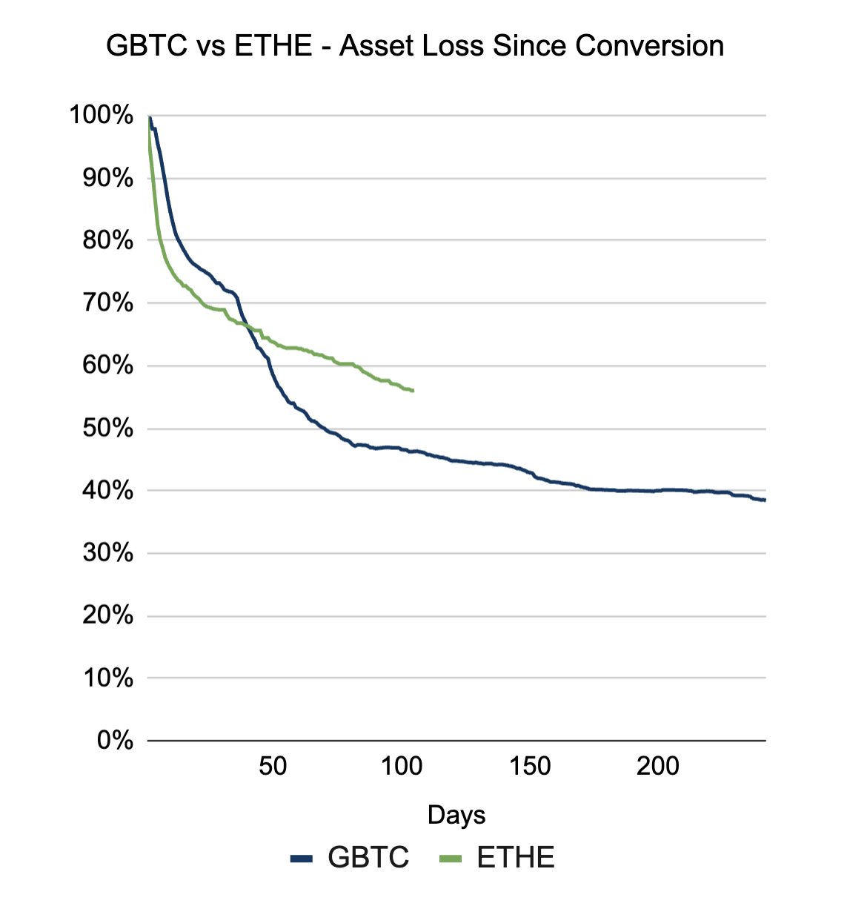
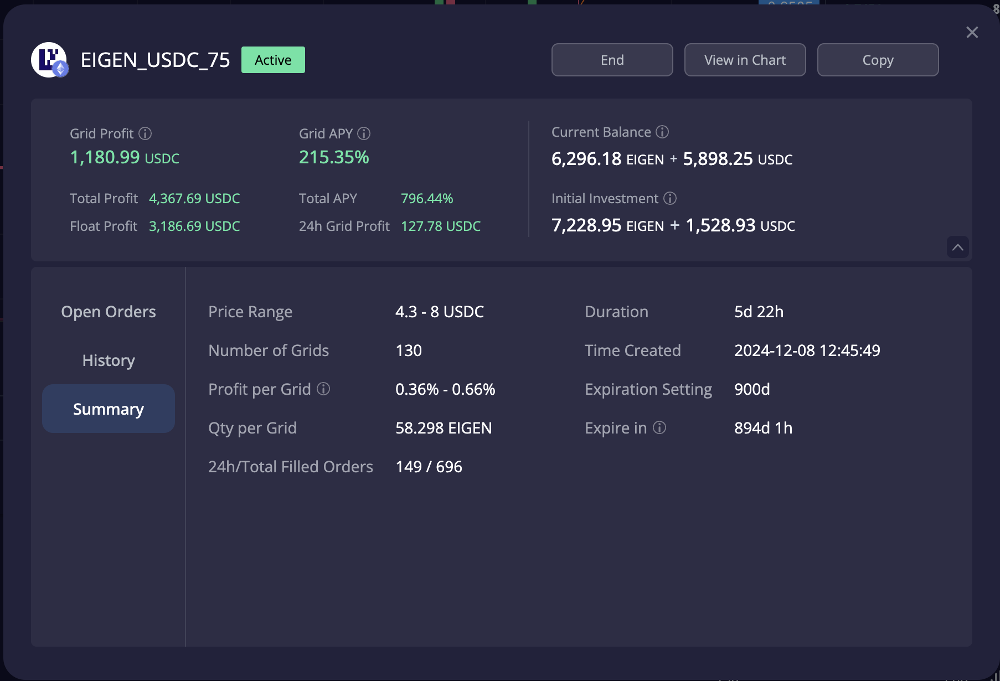
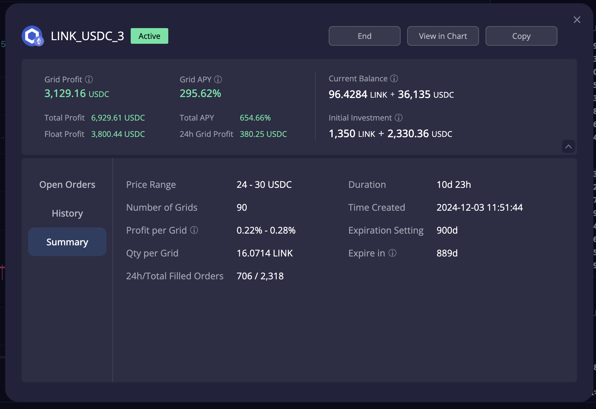

# 加密货币投资周刊 第4期

_本文写于2024年12月14日中午_

扎针!这就是牛市应该有的味道！大家好,我是FatBro - 一位专注于让钱包变胖的资深投资者，这是我的第四期加密货币投资周刊。

本周的市场可谓是波动巨大，12月9日当天，以ETH领衔的飞刀系资产突然从3900美元的价格扎针到3400多美元，然后在几十秒时间里面又迅速拉回到3700多美元，瞬时产生了剧烈的震荡。观察当日的爆仓数据也是超过了当年的312，但实际的体感上并没有这么恐慌，我猜测原因应该是加密市场今天更成熟了，体量更大了。

回到基本面上，本周的ETF流入量继续保持强劲，BTC和ETH的ETF流入量继续强劲，MicroStrategy也被纳入了纳斯塔克100指数，这些都表明了传统资金对于加密市场的认可和看好。美国CPI和PPI的数据也符合预期，12月份降息25个基点基本上是确定的，不过目前市场对2025年的降息预期可能只有两次，所以明年的利率水平还是维持在4%+，利率长期的下降预期还有待观察跟进。欧洲央行本周也完成了本年度的第四次降息25基点到3%的基准利率。

本周也是ETH ETF上线100天的时间节点，分享一个有意思的数据，是指ETF上线后灰度信托GBTC和ETHE的outflow速率对比图，可以看出100天时GBTC的已经流出了超过50%，而ETHE100天时刚刚超过40%，我们可以看到GBTC在超过50%后outflow就变得相对平缓了，所以我猜测ETHE的出清速率也会在不久后调整斜率，开始趋于平缓，ETH Etf的inflow对于行情的影响的质量和效果会越来越强，让我们拭目以待。

## 上期预测回顾

在上一期周刊中，我们做出了以下预测和建议：

### 挂一些飞刀单
   - 预测：牛市多扎针，接一接飞刀
   - 实际：上周我的嗅觉也算是灵敏的，就是意识到牛市最缺的东西还没出现. 但是建议的3650美元挂点飞刀单看起来似乎还是保守的，好在如果接到的话也能够获得不错的收益，牛市挂飞刀单确实是一个应该拿出来一部分资金执行的策略，这样你在极短的时间就可以获得10%+的的收益。具体执行上可以根据不同的资产品类，按照当前价-10%-20%去挂单，比如现在ETH我会选10%，其他ERC20我会选20%，BTC我会选7%。

过去几周的单一代币上本周没有什么可以过多分享的，Puffer/ZK/LDO还是有较强的表现，在回调中进行调整。其实在周中我也抓到一次机会在0.69美元位置挂单买入了ACX，本来我想在上周的周报中分享ACX，但是由于我刚想写文章时突然就上了币安，造成了价格的剧烈拉升，我认为不是一个很好的时机去分享给大家，所以等到ACX回调时才在我的交流群里面分享给了一些朋友们。

经过这个事情后，我进行了一些思考，发现每周的周刊对于瞬时机会的把握还是不能分享的很好，所以我也思考后做了一个决定，来开一个交流的telegram群 [https://t.me/FatBroCN](https://t.me/FatBroCN), 日常就会分享一些周中的策略和突发的机会，也欢迎大家踊跃的交流。

## 策略回顾

### 第一个实战操作
本周网格表现我觉得比较值得提一下的是Eigen的表现，Eigen本周有了一些突破，所以我也调整的范围，关闭了很多之前的Eigen策略，将上限调的更高，以下网格就是4.3-8，跑了5d22h的表现，收益率依旧保持在200%+

### 第二个实战操作
本周特朗普相关的WILF项目进行了一个很有趣的操作，将募集到的资金通过COWSWAP购买了LINK和AAVE，这使得这三种资产发生了剧烈的波动和拉升，这使得我其中一个LINK的网格产生了巨大的波动，获得了很高的收入，24-30的网格，10d获得了3129USDC的收益，收益率到达接近300%。 

我觉得更有意思的事情我其实是期待WILF的第二笔代币购买是继续购买LINK和AAVE还是去购买另外一些资产，如果持续购买LINK和AAVE，那么对于这两个资产是巨大的bullish信号，如果购买其他资产，那么对于整个以太坊系的老牌DeFi生态是巨大的bullish信号。如果有小伙伴知道WILF购买资产选择的底层原因，欢迎与我分享，不会只是ym集团那么简单吧:)

## 下周展望和建议
市场逐渐到了圣诞季，可以明显看到整体的成交量没有前几周大了，但是通过对历史的分析其实也总结不出圣诞季的规律，所以市场是不可预测的，但是我认为右侧行情的大趋势是确定的，所以我会继续持有大量仓位，并利用网格工具和波段，扎针等策略进行收益增强。当然，第一次看文章的读者，十分推荐回顾第三期：牛市如何卖好币！

本周文章里面就推荐一个新资产，其实已经有几个看好的，还需要做一些进一步调研，希望在下一个周报更系统的分享，大家也可以加telegram群，我提前会在群里分享。

#### ACX（Across Protocol）
1. Unichain cross-chain intent 跨链的基础设施， 在所有的桥里面是最具场景化的，和最大的去中性化交易所的业务强绑定，和L0 , wormhole , Axelar 这样的general资产信息桥不同，业务上是独特的排他的，而不是同质化业务不同桥内卷的，从投资角度讲，我会认为是UNI的杠杆。
2. EIP 7683叙事的主要推动者，可以理解为UNI/OP/ACX是一个“阳谋集团”。
3. 炒新不炒旧，刚上币安，次新，此前没有上过大所。 bybit , okx , upbit都还没上呢
4. FDV比较属于有空间，wormhole 3B, axelar 1B, across 800M

### 社群交流
欢迎关注我们的社群,与其他投资者交流经验:
- 电报群: [https://t.me/FatBroCN](https://t.me/FatBroCN)

### 工具选择
网格策略会使用去中心化交易所DeGate进行交易,[https://degate.com](https://degate.com/?utm_source=fatbrozh_4)

DeGate是基于零知识证明的订单薄DEX，具有用户在自托管前提下，提供接近中心化交易所的交易体验，并且Maker免费的特点对于网格用户极其友好。

免责声明：本人不是专业的理财顾问。以上内容仅代表个人观点和经验分享，不构成任何投资建议。投资有风险，入市需谨慎。所有投资决策请根据自身情况独立判断，风险自负
