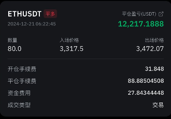
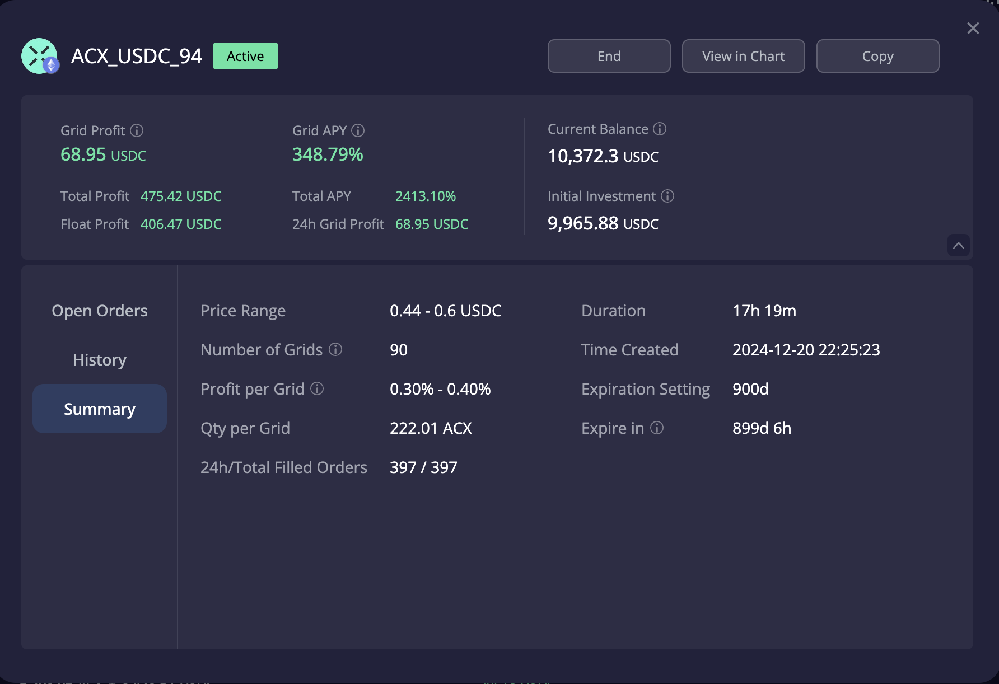
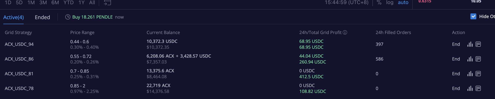
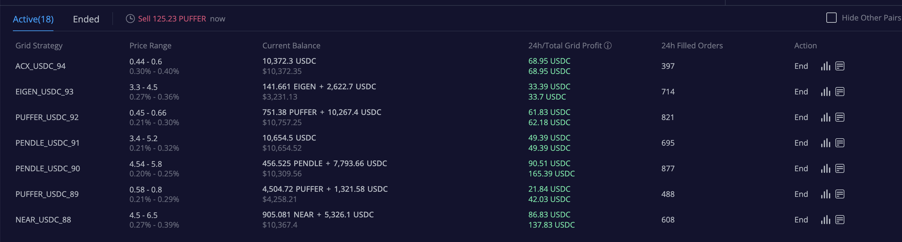
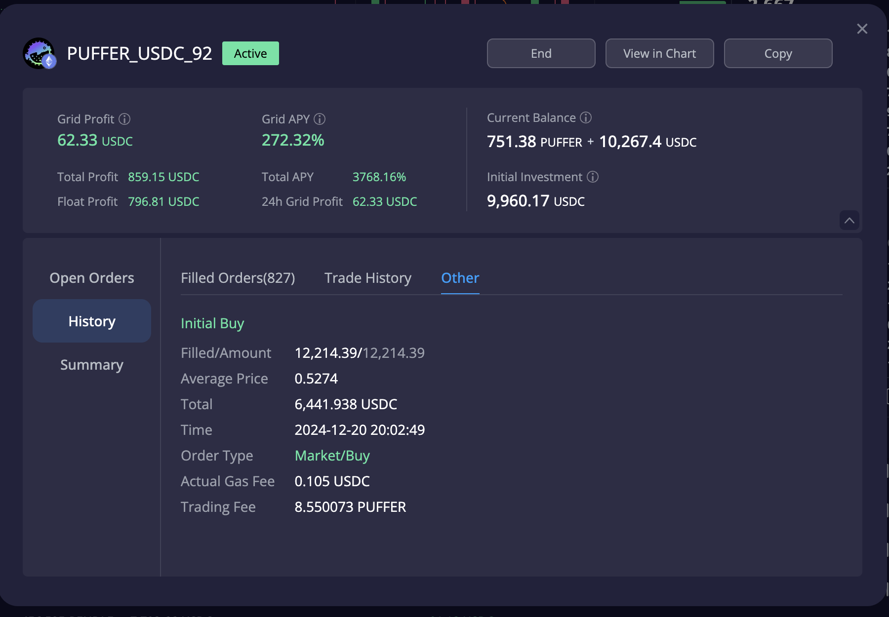
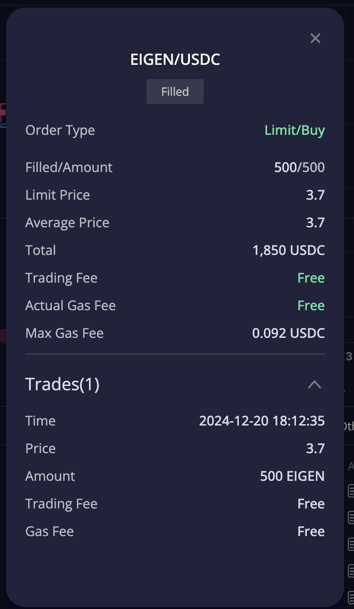
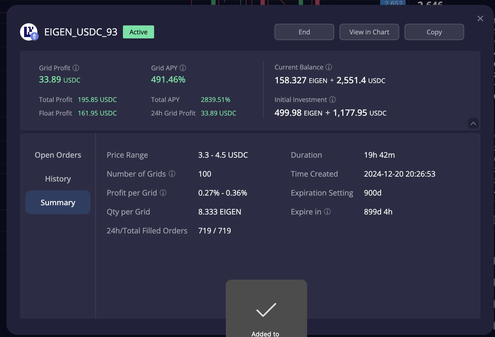
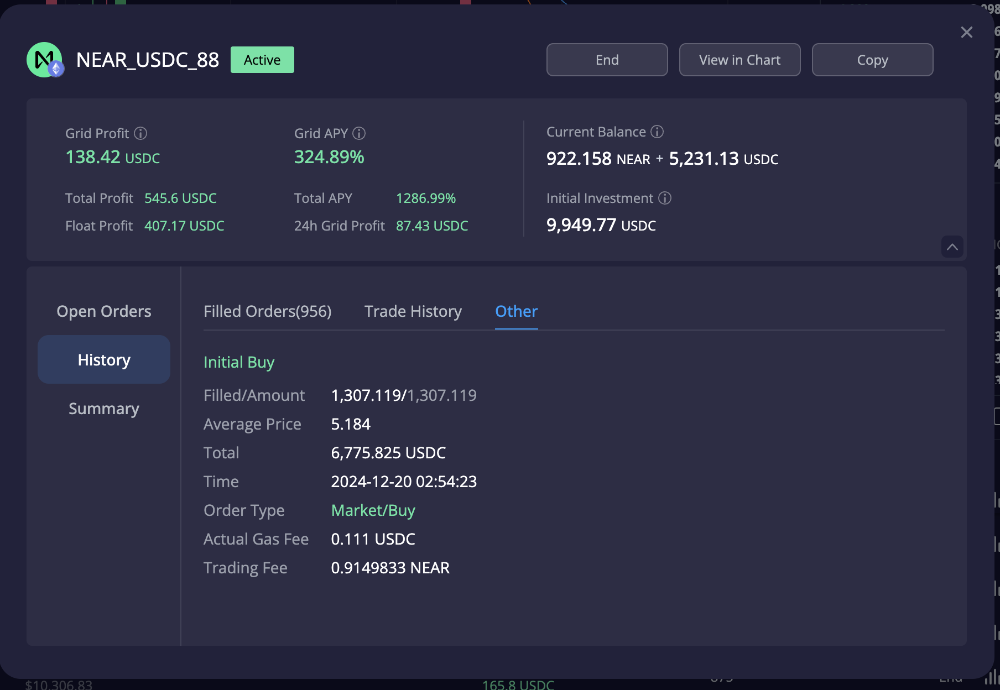
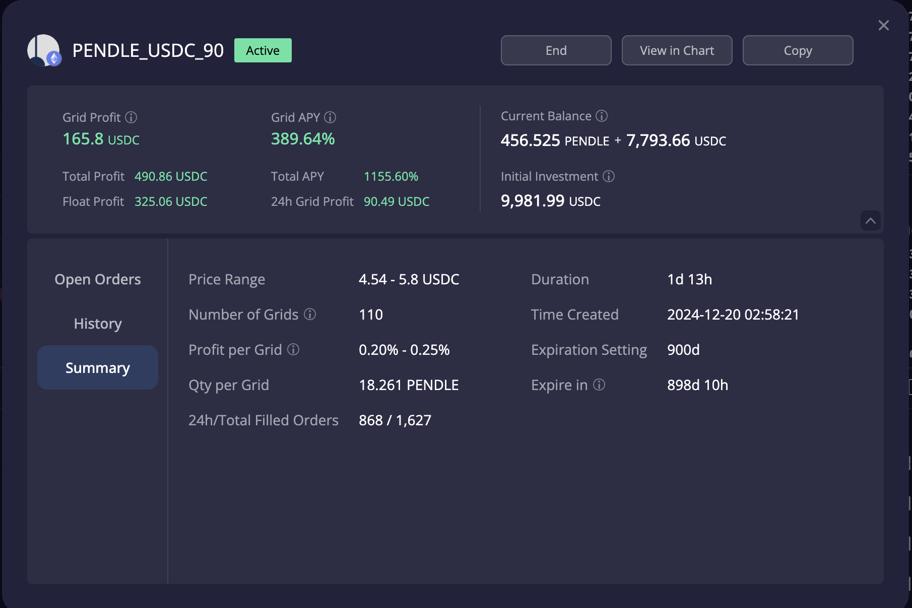
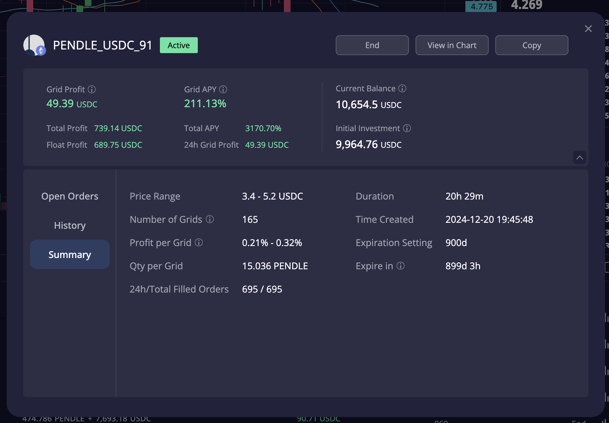

# 加密货币投资周刊 第5期

_本文写于2024年12月21日下午_

牛市也亏钱？尝试建立牛市的节奏感！动次打次！大家好,我是FatBro - 一位专注于让钱包变胖的资深投资者，这是我的第五期加密货币投资周刊。

本周的市场可以说是极具戏剧化的一周，周中美联储的鹰派使得市场对降息的预期大幅下降，市场开始出现大幅度的回调，BTC从最高的108000美元一路下探到92000美元后起稳，后因资金抄底情绪浓郁和美国本月PCI的超出预期的表现，市场在周五晚间迅速回温，截止发文前，大多数币种已经收复了大部分的下跌并呈现上升趋势。

随着牛市的推进，本周也是很多空投项目密集发布的一周，我们看到了Penguin的一夜暴富，单个NFT空投8w多美元，直播直升机撒钱。在这波下跌反弹中，SUI上演了V字反弹，可以看出资金的青睐，我们也看到了ENA的弹性，直接一天收复失位，下周就进入圣诞假期行情了，利用假期，市场可以好好进行一些整理，等待新的机会。我对后市的观点还是一贯的，虽然有波折，但暴涨暴跌，这就是牛市特征

不得不说这次的突然回调，使得很多前期追涨的投资者产生了巨大的回撤，大呼，牛市居然也能亏钱。并且因为牛市的激进心态使得手上没有更多的资金可以抄底补仓，在下跌过程中国呢产生了一种无力感。其实，牛市亏钱并不是什么新鲜事，牛市亏钱的原因有很多，但是我认为，牛市亏钱的核心原因在于，牛市中，人们往往过于乐观，而忽略了风险的存在，而当市场出现回调时，人们往往因为恐惧而选择卖出，而忽略了市场的长期趋势，掌握牛市应该有的节奏感，保持好仓位的配比是至关重要的，今天的周刊，我会分享一些我自己用的掌握牛市节奏感的技巧。

## 上期预测回顾

在上一期周刊中，我们做出了以下预测和建议：

1. 连续两周建议大家建立飞刀单策略
   - 我很好的实践了飞刀单战略，在3400以下最终以3300左右的价格接到了80个ETH，今天早上起床出门前 3472左右，因为发现K线还不是很稳，直接就take profit了。 有人可能会问，为什么这么快就take profit，其实，这个就是接飞刀应该有的策略，这部分资金只做极短线的抄底反弹，而不应该把这部分资金融入到总仓位里面，不然如果发生再次回撤，下一次就很难执行飞刀策略了，出货之后，我有重新挂回了3000左右的买单，等待也许会发生的下一个飞刀。这里我要讲的还是节奏感，平衡好仓位，不要让某一个策略的资金轻易的转变为另一个策略，飞刀短线变成了中期囤货你就会失去下一次机会。不过对于还没有基本仓位的朋友，飞刀行情的时候去建仓是绝对明智之选！
   

2. 推荐了ACX
   - 推荐理由：我认为ACX是一个很有潜力和空间的币 
   - 实际操作：本周ACX也和市场行情一样，产生了巨大的回撤，这给了我一个机会入场，我利用了三个网格分批进行了建仓操作，也在相对次低位置开设了抄底网格进行抄底，Float Profit表现的不错。

以下的四个ACX策略是我分别在不断下跌过程中分批创建的，其实第一个已经因为强有力的反弹，向上出格，我应该会在企稳后关闭直接锁定收益。当前次低的网格也已经进格，进一步开始产生了收益，随着持续的波动我将不断收益网格产生的波动收益，我的第四个网格是在0.85-2，这就是我短期对于ACX的预期，我的心里目标是能够到达2，然后我在上涨过程中能够吃满网格收益。

所以这里面，我其实利用了网格分批抄底的功能，在下跌过程中不断分批抄底，在上涨过程中不断分批止盈，这就是牛市应该有的其中一个节奏感。这样会使得你大多数时间都保有足够的资金来应对突然的回撤，不断去降低持仓成本和阶段性的获取收益。

3. 周中的Telegram推荐
因为上周开始开设了电报群[https://t.me/FatBroCN](https://t.me/FatBroCN)， 在周中也进行了分享，比如12月17日再次推荐了Puffer和首次分享了Morpho，Puffer这也触及了0.9的高点，Morpho上演了图片回撤和V字反弹。希望获得周中的一些灵感的随笔分享的朋友，可以加群。当前这两个资产都是比较适合继续建仓的资产，建议逢低买入。

## 建立节奏感技巧分享

因为前面几周的行情非常火爆，我的很多网格都向上出格，我在大多数时间都选择进行关闭网格，take profit,获得大量的USD来等待下一个低洼的机会，所以在这次暴跌过程中，我有比较充足的U来作出反应不断加仓价值币种，上面的ACX就是其中一个Case。除此之外，如下图，我在探底市场恐慌的某一刻果断的用做多网格的方式用U直接开了7到8个网格。

打个比方，这个puffer网格是我在Puffer价格跌至0.52的时候开设的0.45 - 0.66的网格，当前产生网格收益虽然只有62USD，但是Float Profit已经有近800USD，对于投资10000美元的策略来说，单日已经盈利了10%，如果这个策略继续能够在接下来一周内盘整，则有更大的收益能力。我当时认为是一个很好的机会，因为当时市场恐慌，出现了加速下跌的状况，我觉得即使继续下跌，我也在不断降低买入的成本至0.45，所以果断的抓住了这个节奏。

另外一个例子，Eigen网格，如下图，我开设的是3.3-4.5的网格，但是这个是一个提供500Eigen和1177Eiegen的例子，我为什么会开这个呢，因为挂了3.7购买EIGEN的飞刀单吃到了，那么顺势一单网格，既能够有购买更低价格筹码的机会，又能够抢一波叠加网格收益的反弹，何乐而不为呢。我还蛮期待这个网格在接下来一周的表现的。

以下是另外一些利用网格进行抄底纯U抄底开设做多网格Float Profit截图，供大家参考。

有人问，你为啥牛市都这样了你还有这么多U可以进行这么多飞刀策略，答案是我在很有节奏感的去关闭部分向上出格的网格锁定纯U的收益，控制稳定币的持有量来使得在市场回撤时能够有更多的操作空间。下图仅分享部分关闭的网格，我其实已经关闭了几十个类似的网格，并且锁定了纯USDC收益。

每一个人都应该建立自己的节奏感框架，牛市中不应该满仓进，满仓出，上涨过于乐观，下跌过于悲观。按照自己的风险偏好去执行一些不一样的策略，什么样的回撤应该用网格抄底，什么样的恐慌我应该用带止损的杠杆抄底，都是可以分开去规划的课题，希望大家和我一起思考，一起进步。

## 下周操作建议

因为是假期行情，整体还处在不大稳定的情况下，可以做一些中性的网格策略+飞刀抄底策略。对于长线看好的资产，如果仓位不够的可以进一步进行一些加仓操作。

### 社群交流
欢迎关注我们的社群,与其他投资者交流经验:
- 电报群: [https://t.me/FatBroCN](https://t.me/FatBroCN)

### 工具选择
网格策略会使用去中心化交易所DeGate进行交易,[https://degate.com](https://degate.com/?utm_source=fatbrozh_5)

DeGate是基于零知识证明的订单薄DEX，具有用户在自托管前提下，提供接近中心化交易所的交易体验，并且Maker免费的特点对于网格用户极其友好。

免责声明：本人不是专业的理财顾问。以上内容仅代表个人观点和经验分享，不构成任何投资建议。投资有风险，入市需谨慎。所有投资决策请根据自身情况独立判断，风险自负

