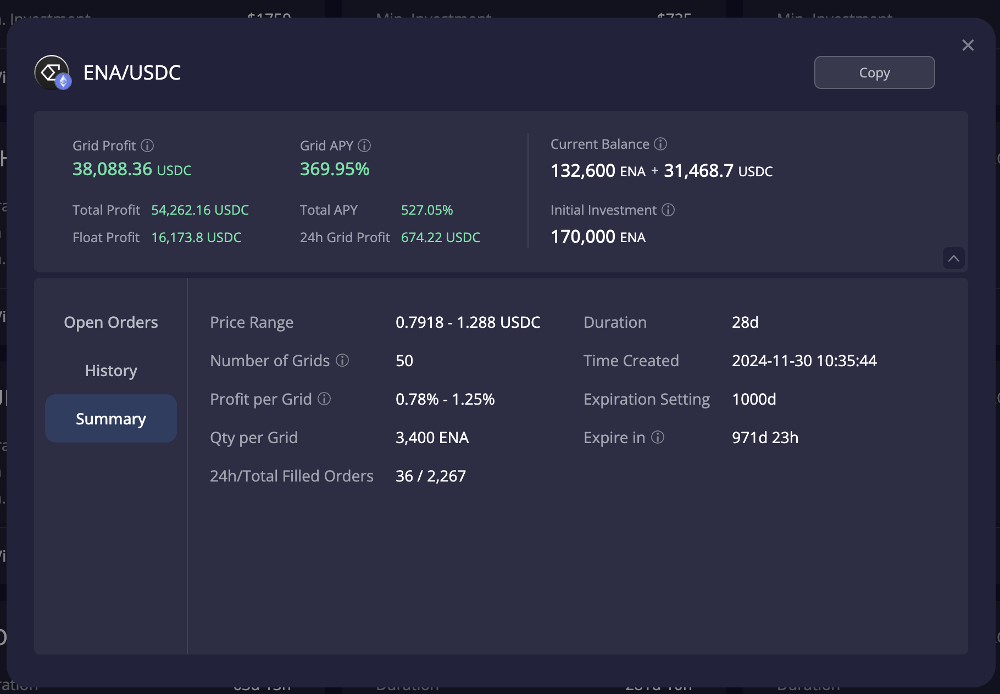

# 加密货币投资周刊 第6期

_本文写于2024年12月28日下午_

边缘革命已经破局！迎接波澜壮阔的2025！大家好，我是FatBro - 一位专注于让钱包变胖的资深投资者，这是我的第六期加密货币投资周刊。
因为本周是2024年的最后一份FatBro周刊，我将暂时抛下对短期行情的观点和对市场热点的分析，打破以往的结构，想借此期和大家分享我对于2025年的一些投资布局和规划，也希望对你的计划也有所启发。

这是我接触区块链13年以来，最期待的一年。那么，让我们开始吧！

## 如何定义2025年？

计划2025年之前，让我来定义一下我眼中的2025年。

也许是一个史上最波澜壮阔的牛市之年！

对于加密货币市场来说，2024年行业用落地了ETF的方式向前走了一大步，为2025年的牛市打下了坚实的基础。这一次牛市也许我们可能比以往任何一次更加明确新的资金是从哪里来的了。
宏观层面，全球又进入了一个相对宽松的货币政策周期，虽然某些区域仍然有通胀的压力，但持续高利率的货币政策已经接近尾声。我们看到比特币正在成为全球宏观对冲的工具，越来越多的企业甚至国家开始配置比特币作为资产配置的一部分。以太坊作为世界计算机的愿景正在逐步实现，以太坊3.0的Roadmap正在逐步推进。

感受生活，我比以往任何时候都感受到区块链技术正在逐步融入这个真实可触碰的世界：
- 全球最大国家的总统家族居然也在发币
- 全球第一大科技界网红居然成为了MEME币发动机
- 世界上的很多金融中心都在招徕区块链创业者，争相比拼发牌政策
- 我居然可以用一张Crypto Card无需任何出入金的方式在2024年可以完成我几乎所有的生活消费
- RWA资产让我发现很多传统金融业的玩家正在用实际的场景和应用来落地区块链技术
- Netflix各种热剧加密行业的提及率已经很高很高了，可知你今天走在大街上随便问一个人，他很可能都知道比特币和狗狗币了
- 如DeSci那样的Funding Public Goods正在成为区块链行业给人类科学发展贡献力量的方式

还有很多，我感受到了，你呢？ 是的，我们不再边缘，我们正在成为主流。

## 2025年，我准备好了

1. 我会坚定的持有更高比率的优质资产
在加密货币领域，选择那些具有高质量和长期潜力的项目尤为重要，因为当市场进入主流时，资本会很关注资产的体量和流动性。要时刻思考，如果水要来，新来的水手们会冲向哪里。如果你还没有进入这个行业，我相信 BTC/ETH 仍然是你绕不开的两个基础选择。而我会还会将枪口指向一些主要领域的龙头。当牛市进程不断深入的时候，高波动性高风险的资产获利后，我会选择套现，然后继续持有长期优质资产。

2. 深耕现有资产币生币增值的手段
在配置某种资产时，同时会考虑资产的增值手段，比如在配置比特币时，会考虑比特币的理财收益，在配置以太坊时，会考虑以太坊的质押收益，在配置DeFi时，会考虑DeFi的流动性挖矿收益。网格依然是一个我的重要的策略，既能够生更多的币，又能帮助套现。这里我忍不住分享一张某网友的截图，一个月完成了30%的ROI的完美收益。

3. 达到既定目标，活在当下
市场总是有周期性，没有天天涨的牛市，也没有天天跌的熊市。市场总是有灰犀牛和黑天鹅，我们无法预测，但我们可以准备。保持一定的现金比率和拥有一个获利了结的计划，是一个成功牛市的关键。参考[《牛市如何卖好币》](https://fatbrozh.substack.com/p/6d0)

4. 紧跟创新脉搏，保持学习，保持思考，发现Alpha
牛市也是创新的温床，让自己充分和这个行业的信息接触，保持对新事物的敏感度，也许下一个Alpha就在那里。

### 写在最后

随着2025年的来临，我们站在新一年的起点，面对充满变化的金融景观。在这一年，愿每位投资者都能够抓住属于自己的机遇，不仅仅在数字货币和传统市场上取得成功，而且在生活中的每一步中都能感受到成长与充实。

愿你们的投资组合不只是数字的增长，更是智慧和经验的积累；愿你们在市场的波动中保持冷静，用前瞻性的眼光和坚定的决策，转化每一个挑战为新的起点。无论是顺境还是逆流，都能以开放的心态拥抱变化，让2025年成为财富增长和个人成就的一年。

让我们一起迎接这波澜壮阔的一年，不断探索、不断成长。
祝福大家在新的一年里，投资顺利，前程似锦！

### 社群交流
欢迎关注我们的社群,与其他投资者交流经验:
- 电报群: [https://t.me/FatBroCN](https://t.me/FatBroCN)

免责声明：本人不是专业的理财顾问。以上内容仅代表个人观点和经验分享，不构成任何投资建议。投资有风险，入市需谨慎。所有投资决策请根据自身情况独立判断，风险自负
