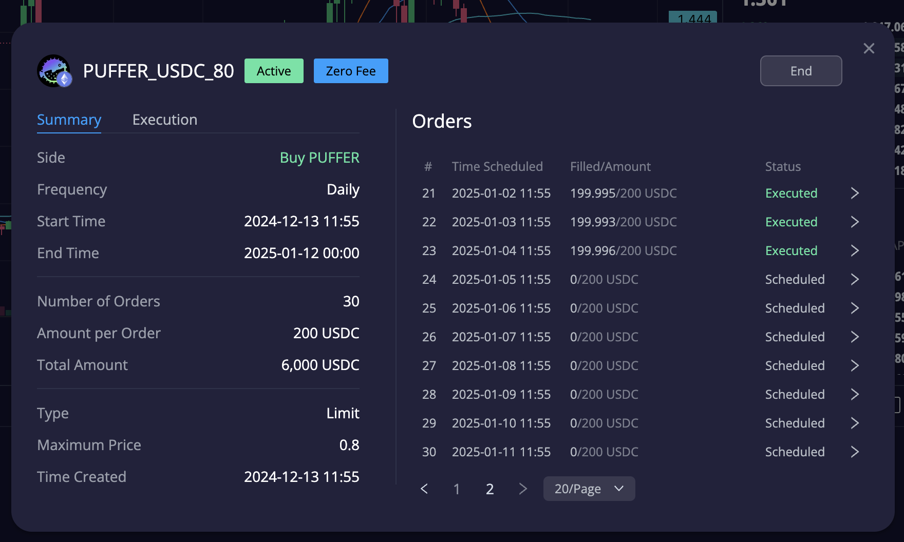

# 加密货币投资周刊 第7期

_本文写于2025年1月4日下午_

AI AGENT时代来临，我想训练一个自己来帮所有普通人实现自动化财富增值。大家好，我是FatBro - 一位专注于让钱包变胖的资深投资者，这是我的第七期加密货币投资周刊。

在过去的一年里，我们见证了AI的飞速发展，从ChatGPT到各种专业领域的AI应用，技术正在重塑我们的生活方式。作为一个长期关注投资领域的实践者，我深深感受到AI在投资决策和执行中的巨大潜力。今天，我想和大家分享我2025的第一个小目标，利用AI来构建一个FATBRO AI AGENT，让每个人都能享受到智能投资带来的收益。

## 本期市场综述

先来回顾一下新年的第一周的市场表现，市场似乎迎来了开门红，BTC ETF在1月3日的交易日中净流入了908M，这似乎是我记忆中最大的几个单日流入量之一，被TAX SELL压抑着的需求终于在新一年爆发。

因为上周文章没有推荐具体的策略，所以本周不做具体策略的回顾，整体上当时间跨过1月1日，整个市场又变得活跃了，除了主流币，MEME币的行情也变得活跃了。我在第五期的时候提到了我接了很多价值币的飞刀，并且开设了Sell High的网格，截止今天看，这些币都有了20%以上的涨幅和表现，持续的网格收益也正在帮我持续的定投我最看好的一些币种，比如Puffer。我的30天定投Puffer即将结束，我应该会在结束后继续开设一个新的定投计划。

在市场热点中，AI AGENT概念股表现亮眼，Virtual 和 Ai16z的热度都极高，似乎在2025年，AI AGENT会是一个无法轻易证伪的赛道。

## Call back半年前我的小记
最近Ai Agent大热让我异常兴奋，我一直有一个训练一个自己来做自动增值投资的想法，并且我一直在思考如何去实现这个想法。

翻出了我半年前在阅读完 [the Grpha 新的 AI Agent 白皮书](https://storage.thegraph.com/ai-inference-agent-service.pdf) 后写的Notion笔记：

> 最有意思的叙事是一个完全去中心化非托管式的AI交易Agent，它能够自我训练，获取数据，资讯自我进行交易决策为产生收益。
>
> 呈现形式可能是一个DAO合约，用户可以认购它的权益，类似与链上的*伯克希尔哈撒韦*。
>
> DAO可交互的合约和协议可以为白名单制，通过治理投票的方式去enable。如策略中是否加入Pendle，pendle社区如果希望这个Ai Agent将自己融入到Ai Agent策略，就要发起提案，透过类似veAgent的机制通过onchain governance去enable。
>
> AI Agent的三要素: 数据层，算力层，交互层
>
> 形成一个交易黑盒模型。
>
> 数据层：具备获取全链数据的能力，特别是Indexing数据，类似于一个给一个炒币很强的人喂入了全链的数据，可以进行自我的回测，统计出这个行业潜在的盈利范式。除了链上数据，如果能够引入现实资讯的数据也许会使得胜率提高，如大模型可以掌握以太坊ETF的预期，会将这个因子混入决策树。
>
> 算力层+Agent service：推理服务，可运行链上交易员的大模型，通过神经网络能够掌握精准的抓住机会和判断交易机会，如果能够达到50%+的胜率则DAO的净值就会不断增长。
>
> 交互层：Agent需要有能力触达到几乎所有general的defi协议。通过一个Replay网络去触发执行交易。也许需要一个隐私交易发送的网络，保证不被MEV。

## 2025年我想训练一个自己

花时间研究了一下 https://github.com/elizaOS/eliza, 是很有趣的框架，和我之前对于AI Agent的畅想的Notion笔记基本一致。

Eliza的 pull request里面有一些ongoing的pulgin，[https://github.com/elizaOS/eliza/pulls](https://github.com/elizaOS/eliza/pulls)，这里面其实是有一些alpha的，你会知道哪些功能正在实现，正在接入哪一些的数据源或者操作的action目标平台。 
所以理论上是可以将我常用的工具都做成plugin来实现我的所有策略的可执行性，比如做一个degate plugin使得 Ai Agent可以在degate上做一些组合型的策略的，比如网格收益定投x币种这样的很Fatbro的策略。

我有一个想法，我也许会用这个框架去训练实现一个Fatbro网格+DCA+Intent 的AI机器人， 每一次操作自动发一个 tg message和 twitter和大家分享，作出一个长期穿越牛熊胜率 > 50%的策略，让任何人可以来订阅我的AI，实现财富稳定增长。

对于数据抓取和执行实现的初步想法是：

- 我主观好感长持项目列表清单： 这是一个本身看好币中的清单，因为Fatbro只做愿意长期持有优质币的网格
- 盘感数据源： 比如一些TradingView的指标信号源，把我的盘感尽量可量化，因为Fatbro选择建仓的时机往往希望是相对低位和趋势底部，我对于飞刀把我的能力大家也是有目共睹，现在我希望量化这种盘感
- 强Alapha项目列表清单： Fatbro愿意用收益部分追求高成长性机会的币种，如收益定投Puffer
- DeGate SDK plugin: 可以让Ai Agent框架带你你来操作进行网格+DCA+闲置资金币本位理财

当DeGate能够购买所有币种和触达大多数链上机会时，完全可以不需要CEX的就可以完成所有的策略，这样一个普通人甚至可以订阅Fatbro AI就可以实现自动化的财富增值，且在自托管的条件下。

如果真的实现Fatbro AI，你愿意把我装进你的口袋，帮你实现财富自由么？来[https://t.me/FatBroCN](https://t.me/FatBroCN) 留言告诉我！

## 建议的投资机会
在川普1月20日就职之前，我觉得会有一波不错的行情，坚定的更多的尝试优质资产的做多网格(即卖出网格)，可以参考这个教程 https://www.youtube.com/watch?v=SXwApyWNfsY&t=4s

### 社群交流
欢迎关注我们的社群,与其他投资者交流经验:
- 电报群: [https://t.me/FatBroCN](https://t.me/FatBroCN)

### 工具选择
网格策略会使用去中心化交易所DeGate进行交易,[https://degate.com](https://degate.com/?utm_source=fatbrozh_7)

DeGate是基于零知识证明的订单薄DEX，具有用户在自托管前提下，提供接近中心化交易所的交易体验，并且Maker免费的特点对于网格用户极其友好。

免责声明：本人不是专业的理财顾问。以上内容仅代表个人观点和经验分享，不构成任何投资建议。投资有风险，入市需谨慎。所有投资决策请根据自身情况独立判断，风险自负
