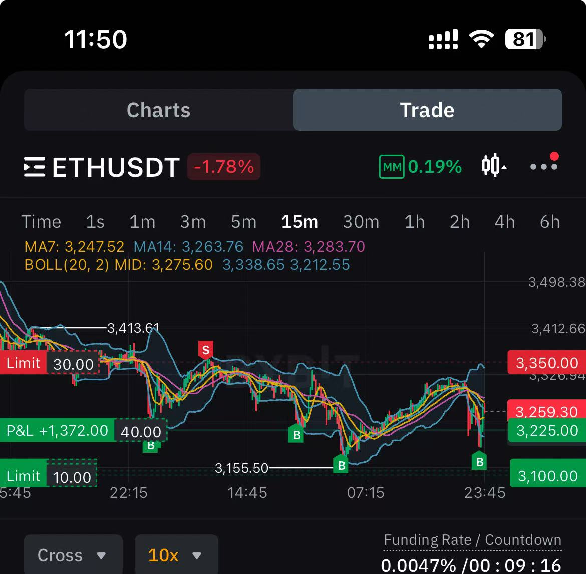
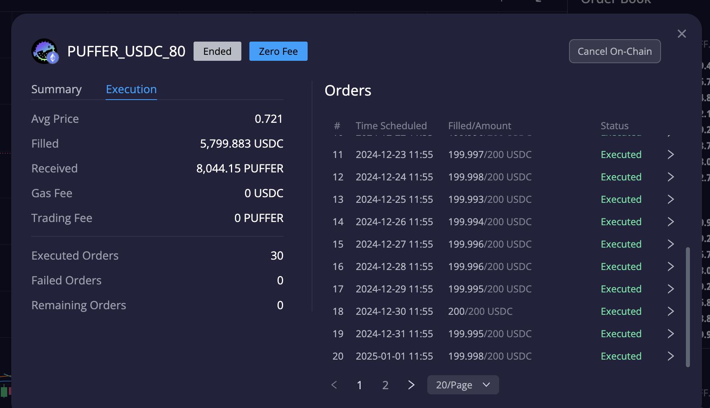
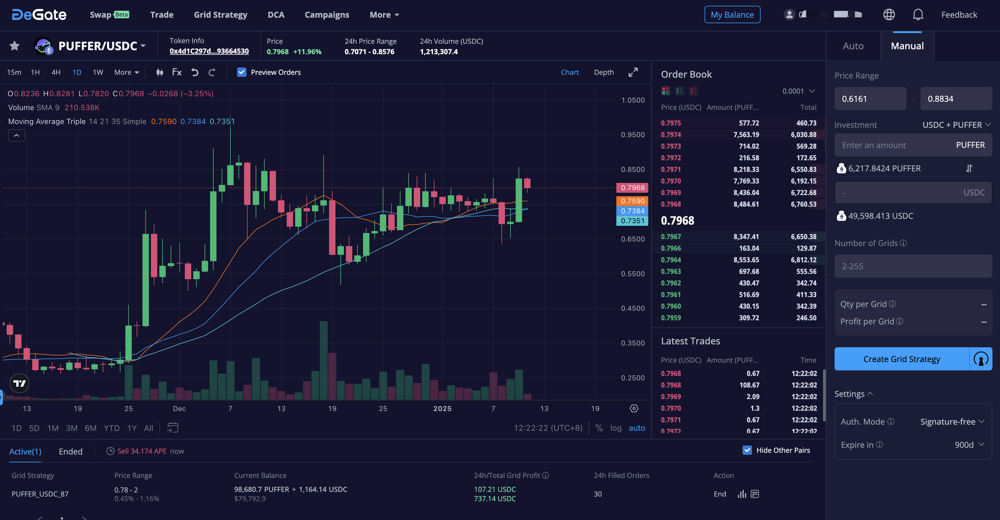

# 加密货币投资周刊 第8期

_本文写于2025年1月11日下午_

不确定性，就是市场的本质。大家好，我是FatBro - 一位专注于让钱包变胖的资深投资者，这是我的第八期加密货币投资周刊。

在过去的一周，全球目光聚焦于美国洛杉矶的山火灾难，司法部给丝绸之路的65亿美元的BTC的出售开了绿灯，引发了加密市场的空头涌动；与此同时，川普成为了美国历史上第一个身负重罪即将上任的总统，FTX的赔付即将陆续进行。可以说，市场在多重重大事件的交错下，正遭遇极高的不确定性，而其中也暗藏着潜在的投资机遇。

本周BTC和ETH的ETF收到不确定性的影响，也出现了流出，加剧了市场对后市的不确定性。但从盘面看来，市场还是有很强的支撑，每次当下探到92000后，都会出现迅速反弹，说明市场还是有很强的支撑和做多的意愿。

本期，我想分享一些在这样剧烈波动的市场中，实际操盘中我会用到的小技巧给读者，可以显著的提高交易盈利的胜率。

## 本周实事分析和我的思考

1. 美国洛杉矶有史以来最大火灾，将给政治和经济带来一些影响

首先，火灾将给洛杉矶的房地产带来影响，房价将上涨，短期商品需求剧增。因为火灾后重建需要时间，重建成本将推高商品价格和人力成本。所以作为一个重要的经济中心，大概率会发生物价上涨，劳动力紧缺，保险费用上涨，通胀上升，美联储也不得不考虑整体货币政策的节奏。

对长期民主和共和两党的政治格局，大火会给共和党和川普带来很多优势，民主党为了保护自然资源，保护鱼类的ESG政策导致加州南部的水资源严重不足，缩减消防成本的错误决策，将给民主党带来很多负面影响。

甚至对川普不感冒的美国民众也许会重新评价川普的能力，更多的以人为本，看似有时候的疯狂政策，其实都是为了美国民众的利益，因为川普早在几年前就对洛杉矶的森林火灾风险提出了很多抨击。从外部视角看，这是一个务实的总统。

2. 川普成为美国历史上第一个身负重罪即将上任的总统，也将给政治和经济带来一些影响

另一方面，川普的重罪，虽然被免于处罚，对上任没有影响，但从长期考虑，也许会加剧两党之间的矛盾，川普的法律困境将测试司法体系与政治权力的界限，可能会引发关于法律如何适用于总统的讨论。表明美国的共和制度，也许无法缝合美国政治的分野与裂痕。长期对于美元的信心，将受到考验。

3. 司法部给丝绸之路的65亿美元的BTC的出售开了绿灯，将给加密市场带来一些影响

说实话，这个决定的实际执行可能不会这么顺利，很难在川普上线前完成操作，大概率川普上任会认命新的司法部长。但是市场明显对此做出了反应，BTC上行压力在本周已经显现。其他，很大的可能性主力利用这个利空消息，在进行打压市场后低价吸收更多的恐慌筹码。

实质上，川普希望将比特币变为国家储备货币和司法部批准出售丝绸之路的65亿美元的BTC，是独立的两个事件，因为本身司法部收缴的BTC在现行法律下，是无法直接转成国家货币储备的。如果要推行，需要立法支持，使得BTC纳入美国的储备资产类别才可以进行。

所以，更多的是心理层面给市场带来短期的恐慌压力，长期来看，BTC作为国家储备货币的逻辑是成立的。

4. FTX的赔付即将陆续进行，新的流动性将注入市场

FTX赔付即将开始，新的流动性将注入市场，对市场将带来一些积极的影响。

## 我本周的操作

### 接飞刀操作
本周行情剧烈波动，产生了一定的不确定性恐慌，我进行了一些接飞刀的操作，这里分享给大家一些显著能提高接飞刀胜率的方式，大致有两个tips：

1. 对于对行情波动不敏感的朋友。一个相对稳定提高胜率手段就是捂住子弹，只在短时间急跌时进行下手建仓。
2. 第二个提高胜率方式，子弹不要一口气打完，不断的进行分批的底部建仓，不断降低成本，这样即使抄在山腰，也能够不断降低成本，等待反弹。

如下图是我在ETH跌破3300后，多次在急跌发生的时刻进行逐步建仓的截图，并在反弹后，进行一些获利操作。可以看到，只有K线形态出现了加速下跌的迹象后我才进行建仓来不断降低持仓成本。

如果市场回到上升趋势，我又可以进行分批的获利操作，如果行情进入震荡期，还很推荐使用Sell High网格的策略，进行获利。

### 继续建仓一些Alpha资产策略

继续看好Puffer，在这波下跌的过程中Puffer反而出现了上涨，说明Puffer的Alpha属性很强，继续看好Puffer。

我的低于0.8每日买入Puffer的策略也与今天完全结束。共计30天，平均价格0.721.如果按照现价卖出也是获利10%以上的。

同时，我的Sell High网格策略，也重新入格，已经产生了单日100+的收益。

## 新的投资机会分析

对于目前不确定性的市场，我的思路是会更多的操作主流资产，BTC和ETH，以及一些Alpha属性较强的资产。因为不确定性会导致流动性的减弱，如果持有很多的投机性资产，可能会面临流动性不足的问题，往往在流动性不足的情况下，山寨资产价格的跌幅会高于主流资产。但我又坚定的认为，牛市才刚刚开始，高于60%的现货仓位是必要的。

Alpha资产，我会继续挑选盘子FDV小，团队是长期主义，技术上领先，对行业有前瞻性和推动作用，有实际应用场景的资产。

### 社群交流
欢迎关注我们的社群,与其他投资者交流经验:
- 电报群: [https://t.me/FatBroCN](https://t.me/FatBroCN)

### 工具选择
网格策略会使用去中心化交易所DeGate进行交易,[https://degate.com](https://degate.com/?utm_source=fatbrozh_8)

DeGate是基于零知识证明的订单薄DEX，具有用户在自托管前提下，提供接近中心化交易所的交易体验，并且Maker免费的特点对于网格用户极其友好。

免责声明：本人不是专业的理财顾问。以上内容仅代表个人观点和经验分享，不构成任何投资建议。投资有风险，入市需谨慎。所有投资决策请根据自身情况独立判断，风险自负
