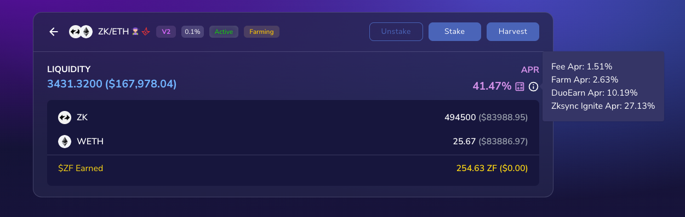
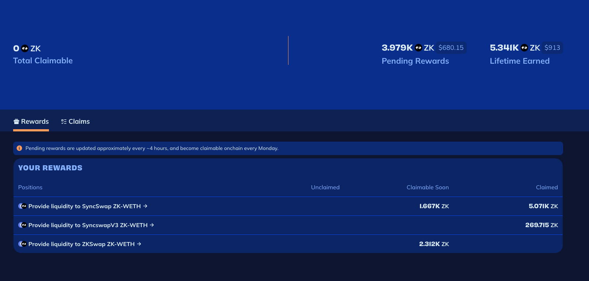
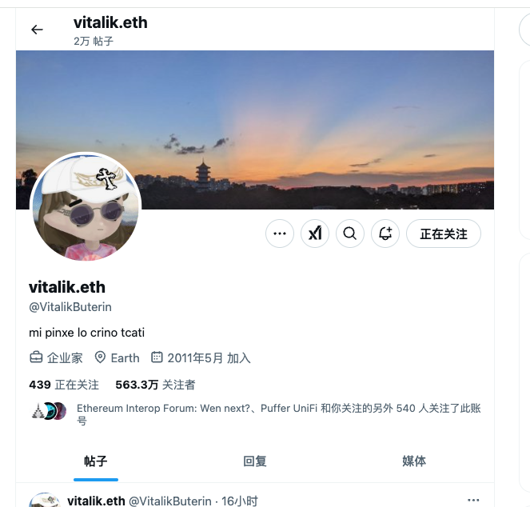

# 加密货币投资周刊 第9期

_本文写于2025年1月19日下午_

你能赚到认知外的钱么？大家好，我是FatBro - 一位专注于让钱包变胖的资深投资者，这是我的第九期加密货币投资周刊。

波澜壮阔的2025的第一幕在本周上演。本周最大的加密市场事件无疑是特朗普发MeMe币了，SOLANA也因为海量的流量突破了270美元，这确实颠覆了我和身边一些朋友的认知。常言道，吃不到葡萄说葡萄酸，但复盘之后，我认为即使再来一次，也许我依然大概率会错过，人很难赚到认知外的钱。认知的建立往往是连续的，知识体系的构成也是连续的，似乎对我来说把握好亿掌握的认知持续深耕，努力跑赢beta，寻找aplha还是最应该做的，不使自己的决策产生变形。当然，当新生事物对原有认知颠覆后学习归纳总结，是提升认知的一个重要方式。

我认为今天是加密历史上面很重要的一天，应该至少所有美国人都知道投资加密货币可以致富。就像2017年的ICO一样，赚钱效应会吸引越来越多的人进入这个市场，开始使用加密货币，使用钱包，拥抱这个自由的，自主权的经济体。我比以往任何时候坚信加密奇点已至！

## 策略分析

### 网格Buy Low
本周我主要按照投资Alpha代币的思路，开启了BUY LOW的网格，例如Puffer我开设了0.62-0.9的网格，一方面赚取波动收益，另一方面期望能够在进一步的回调过程中购买到更多数量的Puffer. 

关于Buy Low网格，可以参考这个视频

https://www.youtube.com/watch?v=H9dyaxrOiBs&list=PLIzd0I3VSbUN45UpuzeTytwddPR7-_zmI&index=4

### zksyncignite大型激励
在链上机会上，ZKSYNC开启了zkignite的激励，会在未来9个月向生态项目激励300M ZK. 如果你有ZK的话，可以尝试的创建一下ZK/ETH的V2 LP,APY大约在42%，也有更高收益的策略和池子，但我认为这个策略是我个人喜好中风险和收益最匹配的。

我通过大约50w枚ZK和25枚ETH在10天的时间里面获得了将近1w枚ZK。

详见https://app.zksyncignite.xyz/

## 投资机会分析
本周因为TRUMP MEME Coin吸收了场内巨大的流动性，大多数代币都开始了下跌，市场上的资金大量流向了SOLANA，随着时间的推移，一部分新入场的资金会继续留在SOLANA上，会流向SOL和SOLANA生态上的其他MEME币种，一部分也会回归到价值但是价格相对低洼的生态上。代币推荐上，我认为这波吸血行情AI MEME COIN有了大幅的下跌，可以关注一些头部的品种，比如AI16Z和VIRTUAL。

对于以太坊，虽然市场上再一次出现了FUD，但我依然认为以太坊是区块链世界最符合区块链精神的的智能合约平台，虽然价格出现了下跌，但是ETF流入依旧持续，说明场内的抛售并没有影响外部机构投资者的热情。本周值得注意的是Vitalik的twitter，有让人眼前一亮的改变。

第一个是他向社区分享了当前以太坊基金会的重大变革，重申了以太坊的核心价值和愿景，说明Vitalik明确的认识到以太坊在某些方面需要做出改变，可以明显的感受到Vitalik所面临的压力和挑战。

目前 EF 将努力实现的目标包括：提高领导层的技术专业知识水平；改善领导层与生态系统参与者（新老）之间的双向沟通和联系，EF 的职责是支持用户（个人和机构）、开发人员、钱包、L2；引进新人才，提高执行能力和速度；更加积极地支持应用程序构建者，并确保重要的价值观和不可剥夺的权利（尤其是隐私、开源、抗审查）对用户（包括应用程序层）来说是存在的；继续增加对去中心化和隐私技术以及以太坊链的使用，包括用于支付和资金管理。

https://x.com/VitalikButerin/status/1880635379771904423

第二个是他更换了自己的头像，变成了Milady，我认为这是Vitalik在向社区传达一个信号，改头换面以更加社区形象的姿态，与社区一起面对挑战。就像中国人在重大的决定面前，会理发明志。

所以当FUD到达极点之时，就是ETH的春天。共勉！

### 社群交流
欢迎关注我们的社群,与其他投资者交流经验:
- 电报群: [https://t.me/FatBroCN](https://t.me/FatBroCN)

### 工具选择
网格策略会使用去中心化交易所DeGate进行交易,[https://degate.com](https://degate.com/?utm_source=fatbrozh_9)

DeGate是基于零知识证明的订单薄DEX，具有用户在自托管前提下，提供接近中心化交易所的交易体验，并且Maker免费的特点对于网格用户极其友好。

免责声明：本人不是专业的理财顾问。以上内容仅代表个人观点和经验分享，不构成任何投资建议。投资有风险，入市需谨慎。所有投资决策请根据自身情况独立判断，风险自负
