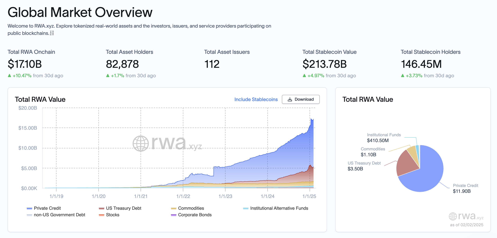
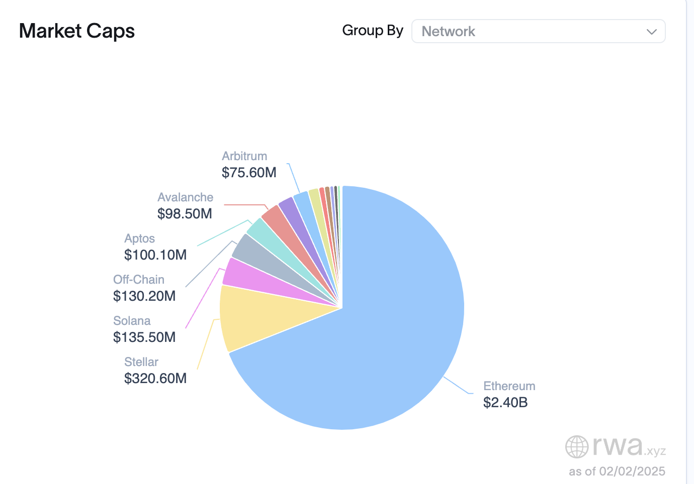
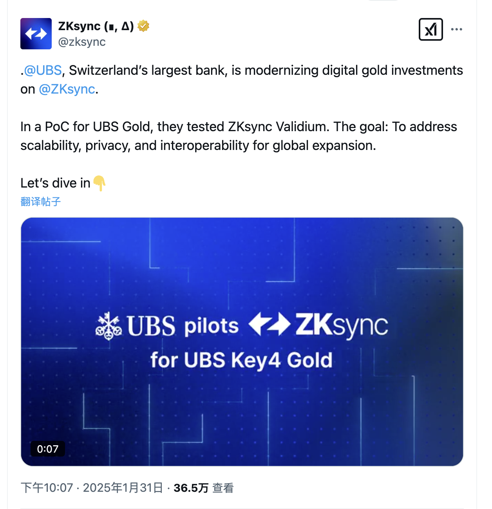
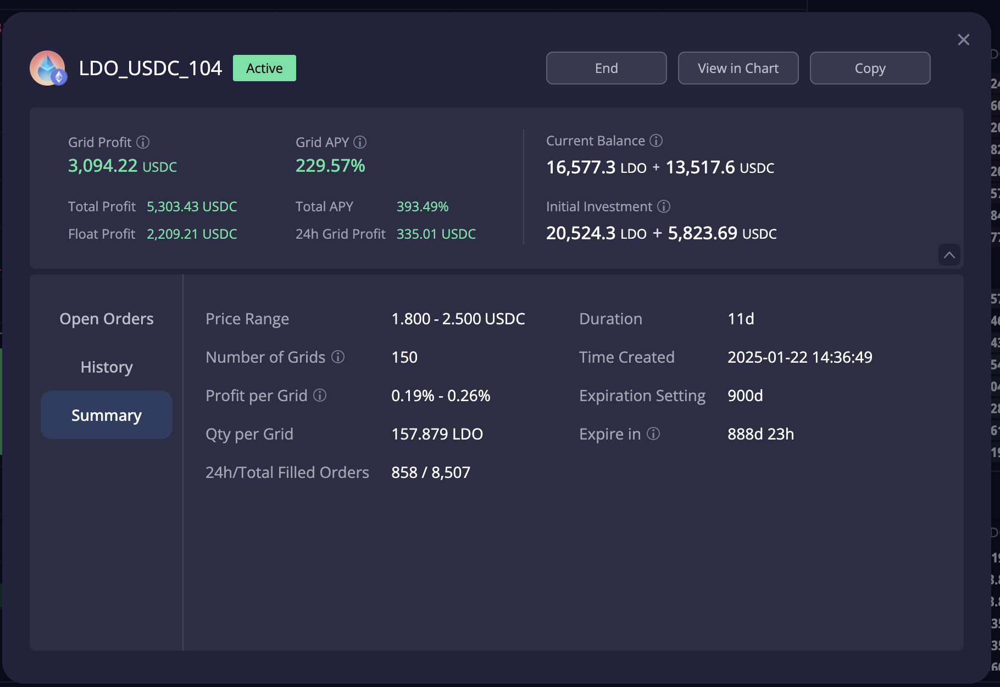

# 加密货币投资周刊 第11期

_本文写于2025年2月1日下午_

Buy the Dip正当时。大家好，我是FatBro - 一位专注于让钱包变胖的资深投资者，这是我的第十一期加密货币投资周刊。

本周，AI领域再次掀起巨浪。Deepseek以其突破性的技术能力震撼市场，不仅在技术层面对标GPT-4，其开源的商业模式更是直接挑战了闭源模型的地位。这一事件引发了投资者对AI公司估值的重新思考，导致美股科技板块大幅回调。加密货币市场随之承压。

另外，本周还值得关注的是特朗普的关税政策的落地，为抵御芬太尼入侵美国，2月4日开始，美国将对墨西哥和加拿大进口商品征收25%的关税，对中国进口商品加征10%的关税，加拿大随即进行了报复性反击，对美国商品也征收25%的关税。与此同时，随着川普上台，将进一步发行美元国债，使得过去一周美国长期国债利率因市场对通胀预期回升和财政赤字预期加剧而大幅提升，导致市场的流动性收紧，对经济进一步增长产生了担忧，美股进一步承压。

本周，欧洲央行明确表态不会将比特币作为储备货币，萨尔瓦多也撤销了比特币的货币地位。这也使得市场对政策面不确定性更加担忧，导致市场进一步回调。

回到ETF，实际上本周在特朗普推出一系列措施导致产生通胀预期之前，整个市场还是很积极活跃的，连续几个交易日中BTC和ETH的ETF本周都有大量的流入。

本周创新继续，Uniswap V4终于上线了，我预测未来几周将会有一系列的创新性的协议基于Uniswap V4进行构建,本周我已经看到了一个很有意思的发射平台 flaunch.gg,它是一个基于Uni v4和Base链的发射平台，增加了如固定价格公平启动和自动回购等有趣的机制，是一次不错的尝试。但是以太坊生态如何将赚钱效应重新带回，还有待考验。

## 上期预测回顾
上一期预测中，我们看到了以太坊社区的一些积极的变化。本周以太坊受累于市场情绪和流动性不足，冲高后出现了回调，同时山寨币也出现了更大幅度的回调。我们可以感受到，如果以太坊不举，我们将看不到山寨的爆发。

但是我看到了一些积极的信号。特朗普家族的WLFI项目，本周继续加仓了大量ETH. RWA资产在过去一段时间的表现非常亮眼，且以太坊是RWA领域当之无愧的王者。以太坊对于安全和去中心化的执着，必将使得以太坊在未来RWA的竞争中脱颖而出，成为加密行业新时代背景下重要的基础设施。

本周ZkSync也announce了UBS正在将黄金Token化，在ZkSync Validium上进行了部署和POC测试。在可以预见的将来，诸如此类事件的不断发生，一些基于RWA资产的DeFi协议将如雨后春笋般出现，给市场带来新的活力和飞轮效应。

另外，因为持续看好LDO，我开设了一个LDO的网格策略，目前收益很不错，本周在其他币大幅下跌时，LDO表现的非常抗跌，可见市场对于LDO长期的看好。在过去11天内获取了年华230%的收益，共计获得网格纯利润3094U，代币浮盈2209U。如果想要快速得知我开设的准确时机，可以关注我的电报群。

## 下周操作建议
抓住时机，Buy the Dip应该是我接下来一周的策略。在ETF in flow， RWA in flow的情况下，我们没有理由看空后市，没有理由怀疑牛市已结束。

### 社群交流
欢迎关注我们的社群，与其他投资者交流经验:
- 电报群: [https://t.me/FatBroCN](https://t.me/FatBroCN)

### 工具选择
网格策略会使用去中心化交易所DeGate进行交易, [https://degate.com](https://degate.com/?utm_source=fatbrozh_11)

DeGate是基于零知识证明的订单薄DEX，允许用户在自托管前提下享受接近中心化交易所的交易体验，而且Maker免费策略对于网格用户尤为友好。

免责声明：本人不是专业的理财顾问。以上内容仅代表个人观点和经验分享，不构成任何投资建议。投资有风险，入市需谨慎。所有投资决策请根据自身情况独立判断，风险自负。
