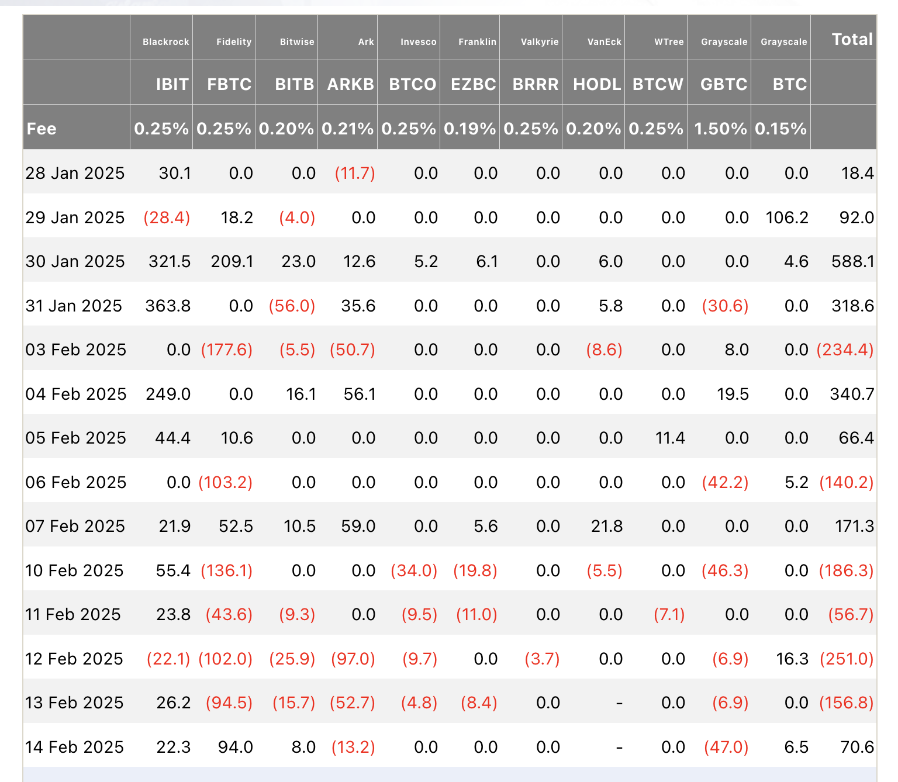
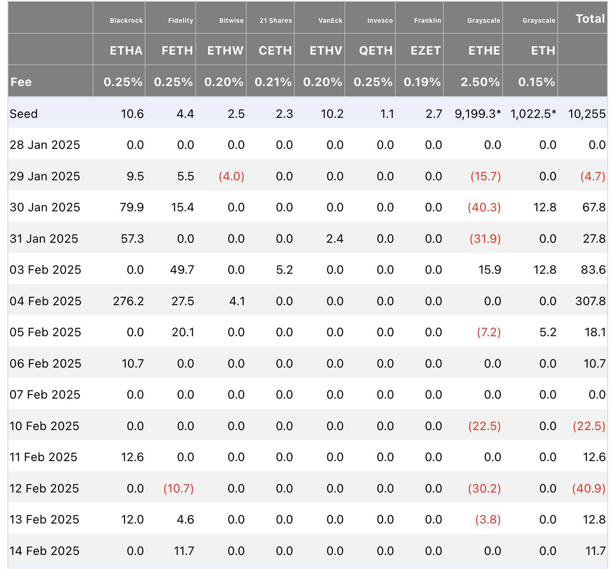

# 加密货币投资周刊 第12期

_本文写于2025年2月16日下午_

计划不如变化，变化不如惊掉下巴，迷茫请不忘初心。大家好，我是FatBro - 一位专注于让钱包变胖的资深投资者，这是我的第12期加密货币投资周刊。

继2月3日市场出现了闪崩后进入盘整，本周的市场看似波澜不惊，BTC和ETH都在进行窄幅的震荡，市场对方向性的判断产生了很大的分歧，似乎进入了短暂的迷茫期。ETF方面也产生了几个有意思的现象，BTC的ETF在连续6周流入后，本周出现了651M的流出，而观察ETH的表现，则在2月3日的暴跌后整体呈现出资本大量流入的现象，似乎这波价格的回调，相对BTC的当前高位，和ETH/BTC的历史低位，使得大资金认为是一个相对比较好的建仓以太坊的时机。

本周备受期待的ETH Staked ETF颇有进展，纽约证券交易所已经向SEC申请允许灰度的以太坊ETF支持质押功能, Cbox BZX也在早先时候向SEC提交允许21Shares的ETH ETF支持staking。[详情请见](https://www.theblock.co/post/341159/nyse-asks-sec-to-allow-staking-for-grayscales-ethereum-etfs?utm_source=twitter&utm_medium=social)

虽然看整个市场币价波澜不惊，但是本周确实几件大事让我惊掉了下巴，再次刷新我的之前在第10期里面开的脑洞[既然世界如此抽象，何不让我们开些脑洞！](https://fatbrozh.substack.com/p/e8a)，再一次让我相信这个世界可能正在变疯：

- 阿根廷总统米莱发了个Libra币，随后删除推特，完成了花式割韭菜，影响极为恶劣难堪，很多P小将损失惨重，以为能复制Trump币的辉煌，没想到进入了一个骗局,真正诠释了越努力越受伤。我也顺利贡献了100枚SOL，EMO中,谁让我也很努力呢。
- CZ亲自下场MEME赛道，突然间市面上出现了几十个叫Broccoli的代币，从我的视角看这里面充满着内幕和操控，也听到了很多普通韭菜沦为炮灰的故事，俨然继第一大“赌场”SOLANA后，币安也坐不住，正在扶持一个新的“赌场”BSC。我想如果接下去4年的主叙事都是围绕着PVP，那么也许这个行业就没有下一个四年了。
- 长达6年的传销项目PI上线OKX，真正开始诠释大妈也疯狂的叙事，可以看到为了流量，头部CEX也是可以突破传统框架的，上线希望不要一地鸡毛。

面对种种的疯狂和不确定性，也许很多朋友产生了迷茫，不知道何去何从。而我个人会从长期视角出发，不忘初心，需要时刻控制好仓位的分配，判断和坚持真正拥有长期价值的东西，去掉一些杂念，无论如何不能下牌桌。
上周，我和邦尼一起做了一期视频，分享了我的投资理念，以及我对于当前以太坊的看法得到了很广泛的关注，已经突破了10万的播放量，还没有观看的朋友可以看一看，希望对你有帮助[点击观看](https://youtu.be/_YEWG7SBqC0)

## 我自己参与的新的投资机会

最近我参与了一些下一代Layer 1的挖矿机会，包括Berachain的Boyco和Movement的Cornucopia,使用我已有的ETH资金来获得一些ETH本位的收益。推荐可以尝试参与的产品有：
方案一: StakeStone的Berachain质押，点击[这个链接](https://app.stakestone.io/u/vault/detail/bera?r=0DAD8)，综合预估年化10%+
- 当前BearStone因为流动性有千分之8的负溢价，可以通过DEX进行购买更划算，如1inch，cowswap。相当于只要等到赎回，你就可以直接获取到额外的ETH；
- 你可以获得Stone底层的LST收益,大约2.81%;
- 你可以获得Bera和Bera一些生态项目的空投(Kodiak和Dolomite)，以及未来StakeStone的空投；
- 方便简单，不用去研究相对复杂的BGT挖矿机制

方案二：通过Etherfi的Liquid Move ETH进行挖矿，点击[这个链接](https://app.ether.fi/liquid/move-eth)，综合预估年化20%+
- 你可以获得WEETH底层约2.88%的收益，还可以获得Etherfi正在进行的Season5，活动KING的奖励（当前1100美元一枚）
- 获得Move代币的空投，需要在4月11日保持质押状态，预估APY为20%
- 额外潜在的一些项目如Veda和LiquidSwap的积分奖励
- 方便简单

Alpha项目推荐：
依旧看好LDO，LDO本周发布了V3，可以看到提出了stVault的概念，任何机构实体都可以利用这个基础设施开展不同参数的Staking业务，这个新功能就是对Staked ETF的完美匹配，当Staked ETF推出后，预计LDO将迎来一波爆发。

## 下周操作建议
我判断ETH未来是一个机构蜜月建仓期，可以选择此处买入一部分现货ETH开启一个Range在+-15%范围中性网格(震荡期持续收益，上涨则获利，下跌购买到成本更低的ETH)，

并且，以太坊最近动作频繁：
- 如将45000枚以太坊投入了Spark，AAVE和Compound中，开放的态度支持DEFI发展。我的想法是，最好能够更多的支持那些Startup但是有创新性的协议，这些老牌的DeFi协议已经很稳定了。
- Beam Chain进行了[第一次会议](https://www.youtube.com/watch?v=sSx6juIu4AI),确定会先改一次名字以更好辨识度和区分已有其他项目代币，我推荐用Ultra Sound Chain，LOL！
- 基金会组织了一次Based/Native Rollups的twitter space，[点击查看](https://x.com/ethereumfndn/status/1887559719075901885)，我喜欢的Puffer创始人也参加了这次讨论。
- Vitalik发布了一篇文章阐述为什么还要扩容L1, [Reasons to have higher L1 gas limits even in an L2-heavy Ethereum](https://vitalik.eth.limo/general/2025/02/14/l1scaling.html),之后我可以写一个号外来单独分析一下这篇文章里面的门道，技术含量很高，但我也有一些困惑，会担心步伐太快的话会显得 **too long** term thinking， 也许步子迈的太快。

### 更多交流
欢迎关注社群,与其他投资者交流经验:
- 电报群: [https://t.me/FatBroCN](https://t.me/FatBroCN)
- 推特: [https://x.com/fatbrozh](https://x.com/fatbrozh)

### 工具选择
网格策略会使用去中心化交易所DeGate进行交易,[https://degate.com](https://degate.com/?utm_source=fatbrozh_12)

DeGate是基于零知识证明的订单薄DEX，具有用户在自托管前提下，提供接近中心化交易所的交易体验，并且Maker免费的特点对于网格用户极其友好。

免责声明：本人不是专业的理财顾问。以上内容仅代表个人观点和经验分享，不构成任何投资建议。投资有风险，入市需谨慎。所有投资决策请根据自身情况独立判断，风险自负
