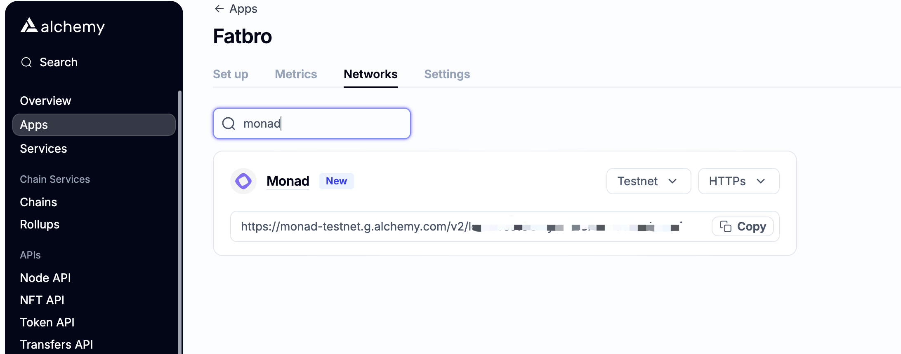
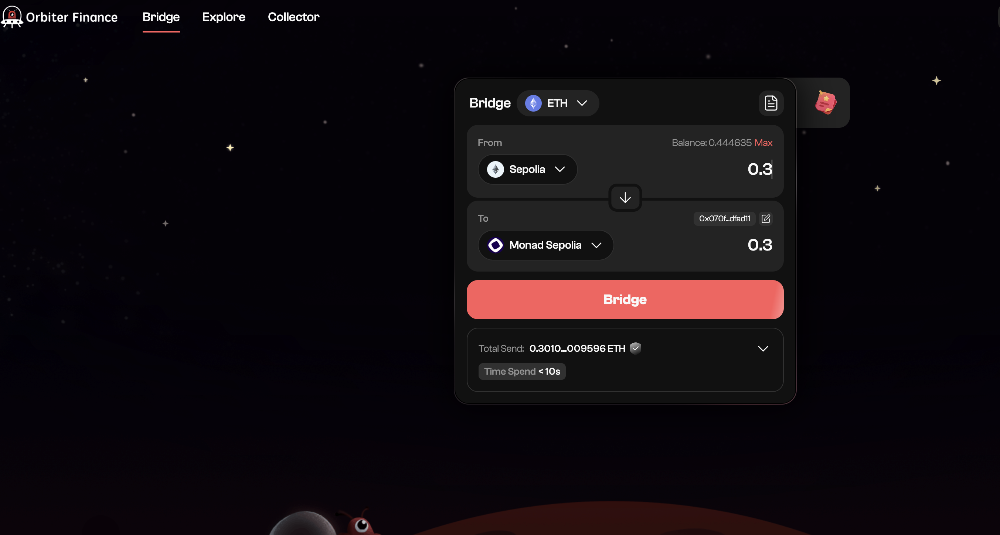
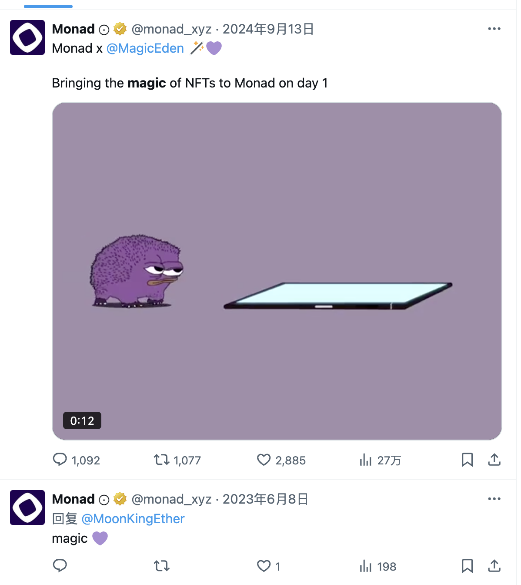
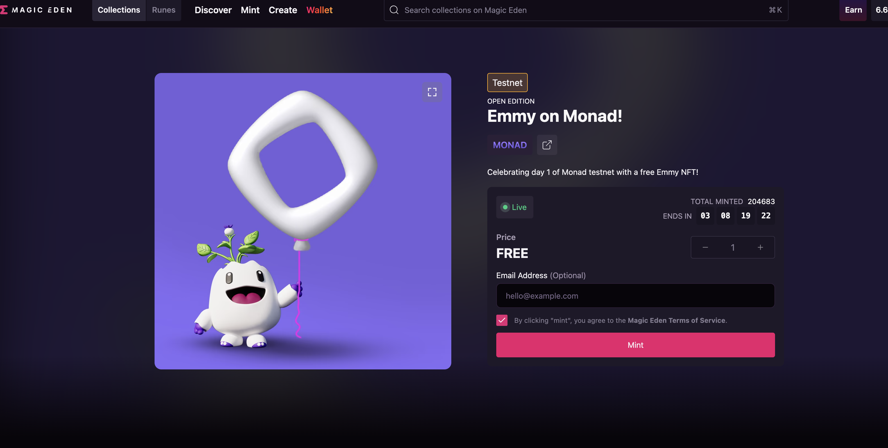

# 加密货币投资周刊 第13期

_本文写于2025年2月23日下午_

惊天大劫案，ETH将何去何从？/必撸的毛，一个都不要错过，撸Monad之干货分享

大家好，我是FatBro - 一位专注于让钱包变胖的资深投资者，这是我的第13期加密货币投资周刊。

本周发生了也许是人类历史上被盗资金最大的黑客事件，bybit交易所大约价值1.5B的以太坊被盗。截稿前，黑客正在利用一些混币平台进行小额的洗币。

关于本次事件的原因和进展大家应该十分了解了，废话就不多说了，我想分享一下关于本次事件几个值得挖掘的点和做一些思想实验：

- 事件对整个市场行情没有造成太大的波动，很好就消化了这个不确定性，当前市场的阶段性支撑已经相对明确了。
- 行业十分团结的面对这一次的危机帮助Bybit度过难关，和FTX不同，Bybit面对危机处理的相当透明冷静，这一次是整一个行业面对外部强大的敌人Lazarus的挑战，而不是当时FTX自身的作恶败漏。这次事件使得全行业团结一致，是很有可能促成建立起加密行业对抗黑客洗币的合作框架和行业屏障。
- ETH价格短期得到了一个较强的支撑，一方面市场上的ETH流动性变相直接减少了0.49%。不仅黑客需要进行也许长达数年漫长的洗钱，还有Bybit必须在公开市场进行ETH的购买来重新达到完全储备，都对ETH有很大的短期支撑，试想Bybit可能未来一年的收入有很大一部分要转换成ETH了。
- Bybit这一次的危机处理值得敬佩，但是作为个人投资者来讲，我会相对的去减少一定的Bybit交易所中的资产储备，原因是这次事件使得Bybit整体损失了大约10%的储备，也就是说短期来对抗另外的风险的能力就减弱了，假如再出现其他的盗币事件，也许就没有办法像本次处理的那么从容，所以做一定的风险分散和资金避险是有必要的。这次事件，其实也一定程度的暴露Bybit在管理代币的多签流程上有一些问题，也许是对于多签proposal的校验停留在UI表面，或者是过度依赖单一工具进行校验，更可能是不胜任的人员参与了管币的流程，多签钱包没有设置单一金额上限也是被盗数额如此巨大的一个原因之一。
- 另外一个有意思的现象，很多人又开始讨论以太坊会进行回滚。我可以很明确的说，现在的以太坊已经不可能因为这类事件进行回滚了，所以不要去听信这类FUD，因为回滚所产生的损失可能远远大于这次被盗金额。那么不如让我们来做个有趣思想实验，再发生什么样的事件有可能让以太坊再次作出像当年The DAO事件一样的回滚性分叉。
   - 可能性1: 突然有一天以太坊遭受了量子攻击，当前的公私钥密码学安全保证被攻破, 椭圆曲线变得可逆。 Vitalik 去年三月的一个帖子很有趣的介绍了这个问题的应对，[假如量子攻击明天就来，以太坊如何解题?]（https://ethresear.ch/t/how-to-hard-fork-to-save-most-users-funds-in-a-quantum-emergency/18901）
   - 可能性2: 因为黑客事件，大于1/3的Validators被单一黑客恶意控制，大于1/3的Validator被控制虽然不会影响交易的排序，但会使得以太坊无法被敲定和最终化。
   - 可能性3: 以太坊的某一次升级遇到了严重的致命漏洞，使得最终性可以被逆转，经济安全性假设失效。

## 新的一些机会

上周分享了Berachain和Movement质押获得空投的几个方式。既然目标是钱包变胖，那么本周想介绍一个门槛更低的大项目Monad的测试网撸毛。我对于撸空投的总体思路是，抓大放小和优化效率。

一个人的时间是有限的，往往需要去抓一些确定性较强的事情，本次Monad的测试网上线，我分析后觉得生态项目已经比较完善了，和当年的Blast的主网生态项目相比有过之无不及，所以看起来这不是一个很粗糙的确定性不强的撸空投机会，而是确定性相对较强的机会。

有几个insight点可以表明应该认真对待这次空投的机会：

- Monad可能是接下去融资金额最大的项目之一，所以市场期待和估值水平也相对较高，有可能出大毛
- 给一些活跃的以太坊地址直接空投了MON的测试币，大家可以用那些被空投到MON的地址优先进行测试网体验，应该可以增加获得空投概率；
- 官方测试网主页上发布了一些入门的体验任务
- 官方测试网主页做了很强的开发者教育和引导，猜测会对开发者群体做空投
- 很多应用的质量，UI的精细化成熟度都比较高，是花了很多资源和时间准备的大的campaign
- 链的状态和响应都很好，TPS很高，达到了设计目标，说明这个测试网已经技术上成熟度很高了，也许是主网launch计划的一部分(使用自己节点API的情况下)

但也有一些不足：
- 公共节点极不稳定
- 很难领测试币MON
- 应用生态没有很好的分类展示，光从名字用户不知道是做什么的，选择太多不知如何选择

### 工欲善其事，必先利其器，顺便掌握方法论

我不想千篇一律的像很多twitter博主那样去发一些流水账的任务，而是希望通过一些例子和最佳实践告诉大家普通人非工作室怎么样更高效精准的去撸空投，和提高成功率的方法论：

#### 第一招: 使用Alchemy API建立自己专属的免费RPC节点 

官方和公共第三方的API因为用的人太多了，非常的卡，十分影响执行交易的效率，这里推荐使用Alchemy的服务一个私有的RPC，
- 通过 https://dashboard.alchemy.com/chains 注册并开启Monad网络

- 复制RPC的URL，配置进入你常用的钱包，如Metamask

这样你的交易将变得极其流畅，毫无卡顿，你会感觉生命突然变长了

#### 第二招: 找到几个可以稳定领测试币的小窍门 

- 因为我发现有很多NFT的mint的任务还是非常烧测试币的，所以需要比较努力的去积累测试币。
- 官方的领测试币的入口有reCAPTCHA的校验，所以一个设备/一个IP，切换不同地址也许不能领很多次，尝试切换设备，使用浏览器的隐私模式可以提高获得MON的概率，另外被初始空投MON的地址能够每12小时领到的币比其他地址多，可以优先使用那些地址来领测试币.(当前官方领取入口已暂停，猜测可能是遇到了工作室突破了reCAPTCHA的防线，预期修复后续会重开)

- 可以尝试通过Sepolia ETH通过[orbiter finance](https://testnet.orbiter.finance/) 跨成Monad Sepolia后通过Monad上的SWAP换成Mon测试币

可以尝试用UNISWAP右上角齿轮开启测试网或者使用[ambient](https://monad.ambient.finance/)进行SWAP成MON的操作。

对于Sepolia ETH呢？就可以很容易的通过很多渠道获得了，比如刚才注册的Alchemy账号就可以去 https://www.alchemy.com/faucets/ethereum-sepolia 获得每72小时0.1 Sepolia ETH

### 第三招：优先做官方相关度高的事情

- 比如testnet.monad.xyz页面上的三个MEME币的兑换肯定要做一下，关注社群，进入Discord也是必做, 网页上还有一个Fantasy Top的卡牌游戏也玩一玩

- 另外一些基础设施相关的比如NAD Name Service，类似以太坊的ENS肯定是可以优先做的

- 生态项目中，和官方合作度高的优先做，比如Monad官方提到过Magic Eden，而Magic Eden测试网Launch Pad里面就有一个免费mint的[Emmy on Monad! NFT](https://magiceden.io/launchpad/monad-testnet/emmy_on_monad)

这种就是显然需要优先去做一下的任务。

### 第四招: 优先做那些融资多，成熟度高，没发币，有长期价值的生态项目的任务

- 因为你有可能在撸Monad的同时撸到其他的头部项目币，这里就可以借助一些外部博主的信息，比如 https://ray80230.notion.site/Monad-127238fd5c2481c6a616ec048bfcf1e7 罗列了当前Monad生态的头部项目，那么你按照谁可能成为第一大AMM SWAP，谁可能成为第一大代币Launch平台，谁可能成为第一大Lending protocol这样的思路去优先进行交互了。

### 第五招：如果你有技术背景，可以尝试建立开发者人设

- 进入开发者 Discord，提问或者提意见，保持一定的活跃度
- Github去fork或者follow Monad官方的一些代码库，提交PR，发布issue都可能增加你被空投的几率，哪怕是一个简单的文档review提出错别字都可能让你受益匪浅
- 用Remix IDE简单的去部署一个ERC20合约，证明这个地址的拥有者有Solidity能力

### 第六招：持续定期的去做任务比一口气做完更重要
- 你应该有一个规划，比如每周操作一个dapp，或者每月4个dapp，而不是第一天操作了几十个dapp，Monad官方当然希望你是一个时刻关注社区发展的长期用户，比如你猜测Monad 6月份上主网，还有13周，那么每周花一个小时进行正常的交互体验，学习一个新项目会让你变得不枯燥。

### 第七招：避免被评判为女巫
- 所有的测试币最好从水龙头领取，不要从一个号转到其他很多地址
- 多用老地址，避免使用什么历史记录都没有的地址
- 多用不一样的设备和网络，比如今天用了Macbook家里的宽带，那么下周就换地址用手机5G网络去操作了

最后列一些我比较看好的项目优先在操作的吧
- Kuru
- Nad.fun
- Curvance
- monadverse
- nad.domains

好了，大家共勉，祝撸毛快乐，钱包越涨越胖！

### 社群交流
欢迎关注我们的社群,与其他投资者交流经验:
- 电报群: [https://t.me/FatBroCN](https://t.me/FatBroCN)
- 推特: [https://x.com/FatbroCN](https://x.com/FatbroCN)

免责声明：本人不是专业的理财顾问。以上内容仅代表个人观点和经验分享，不构成任何投资建议。投资有风险，入市需谨慎。所有投资决策请根据自身情况独立判断，风险自负
