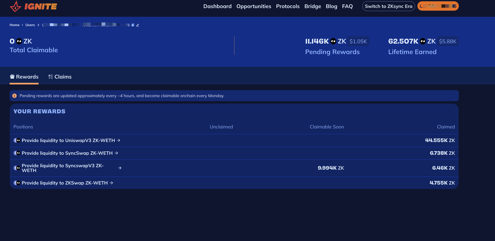
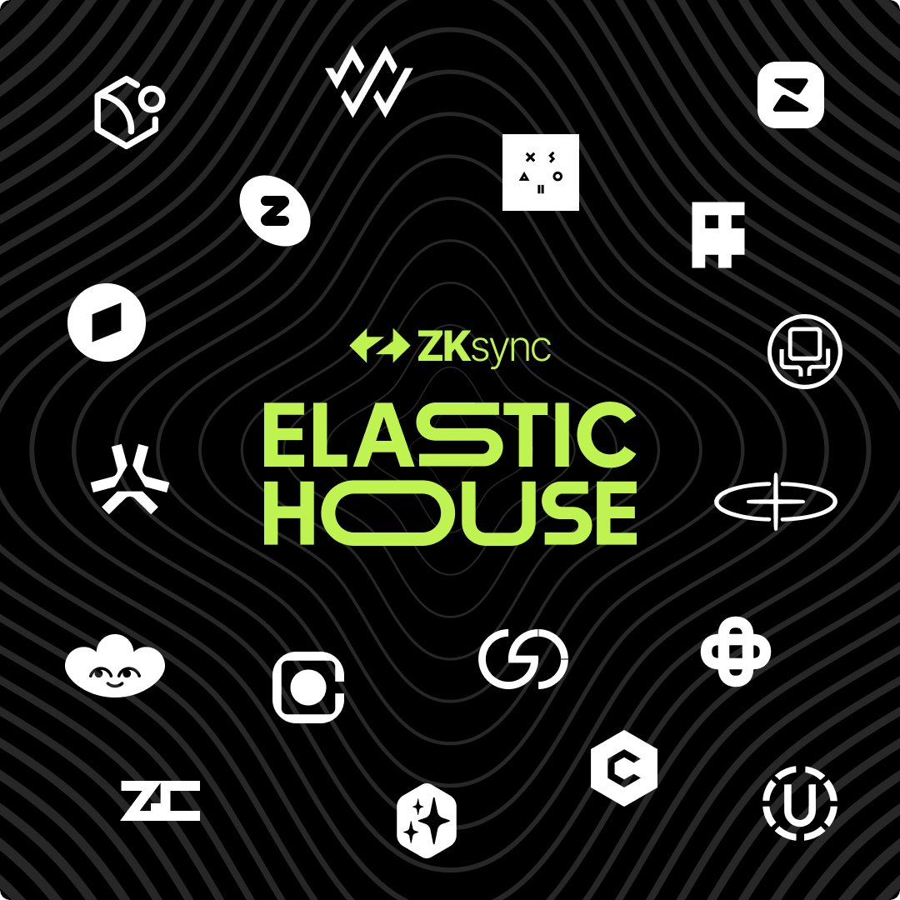
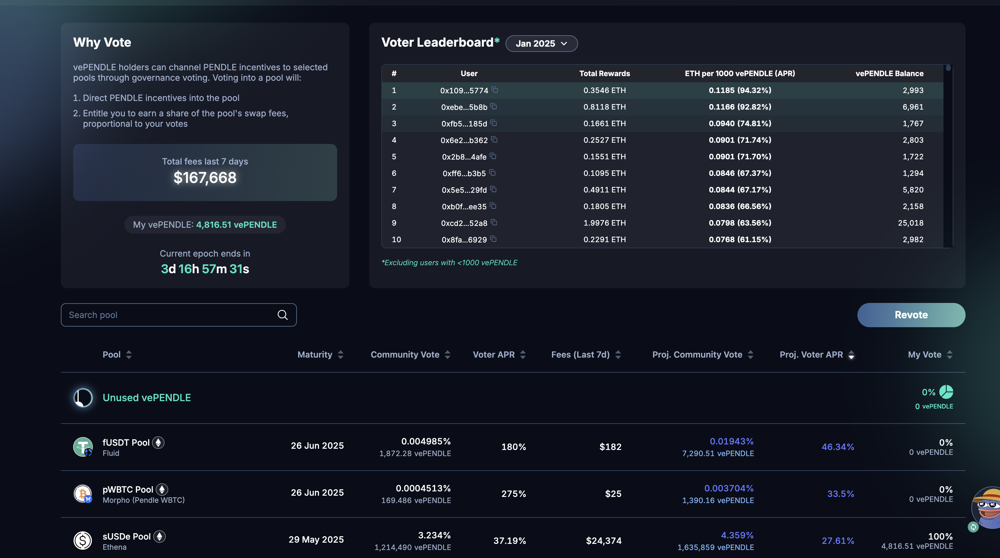
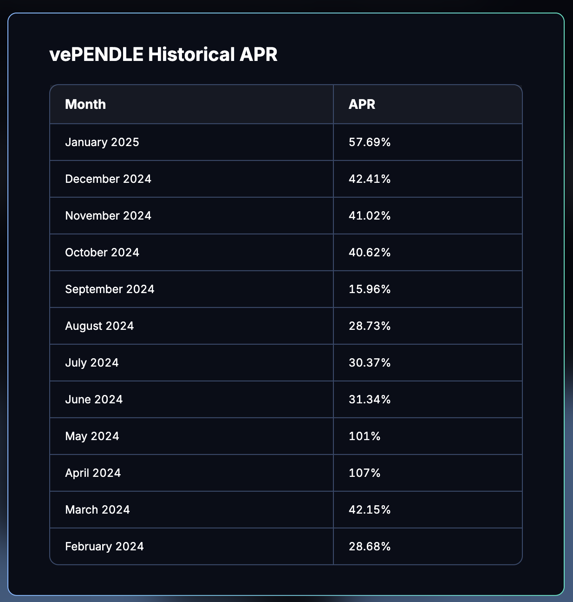
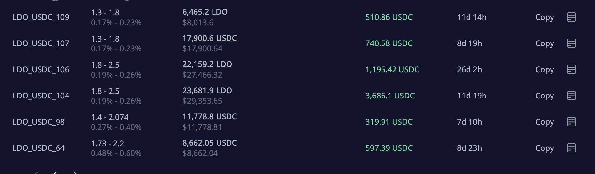
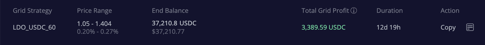
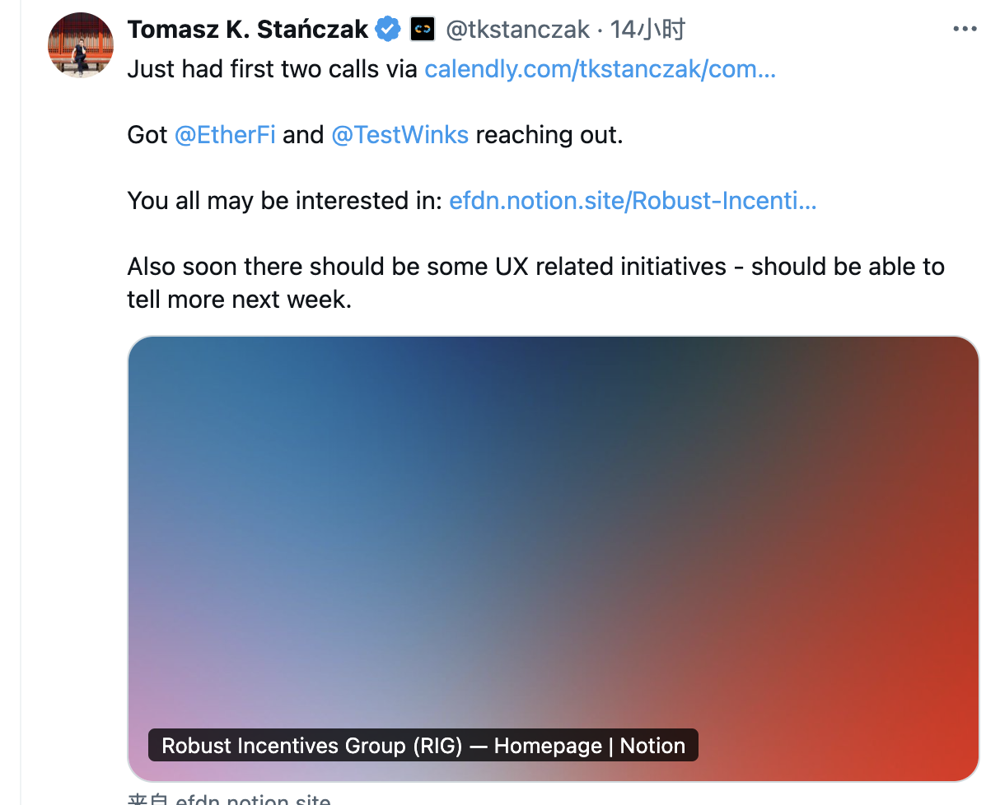
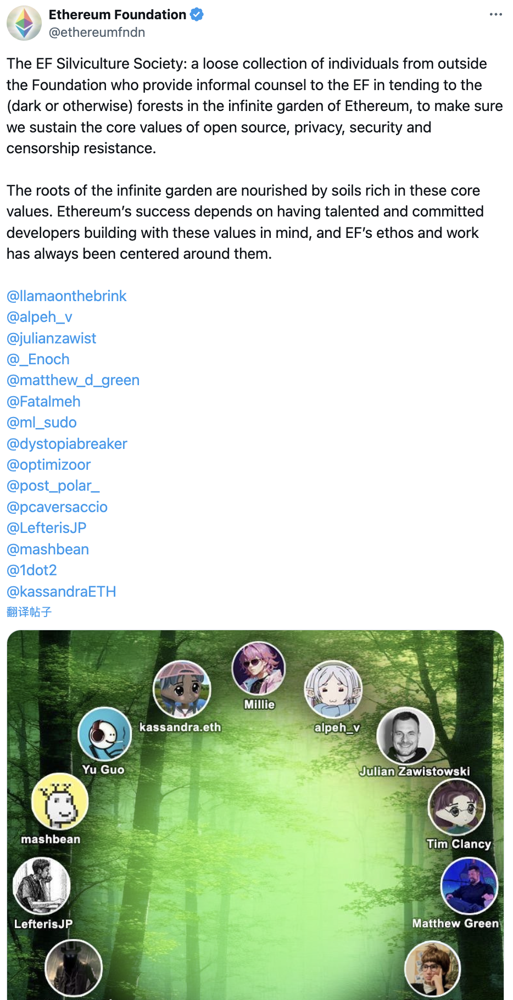
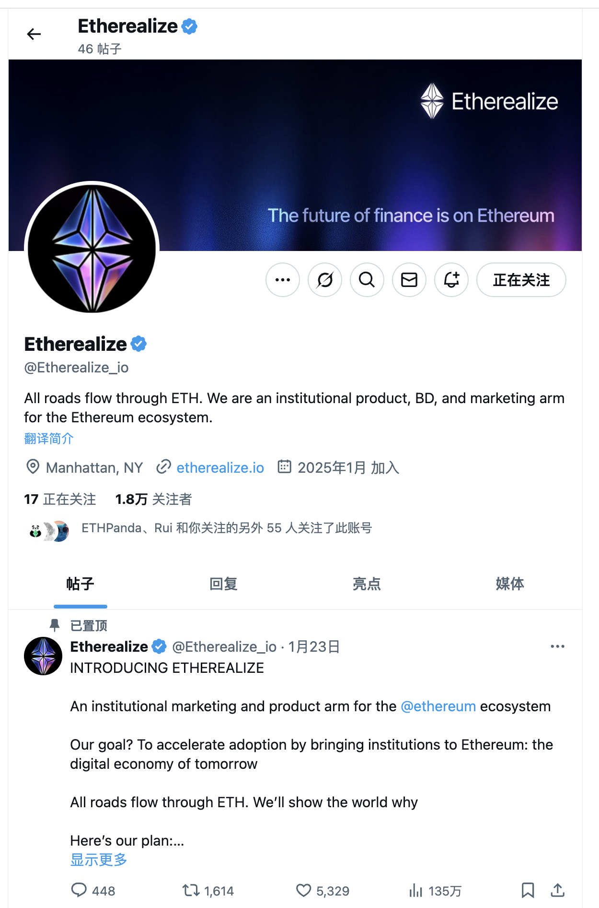
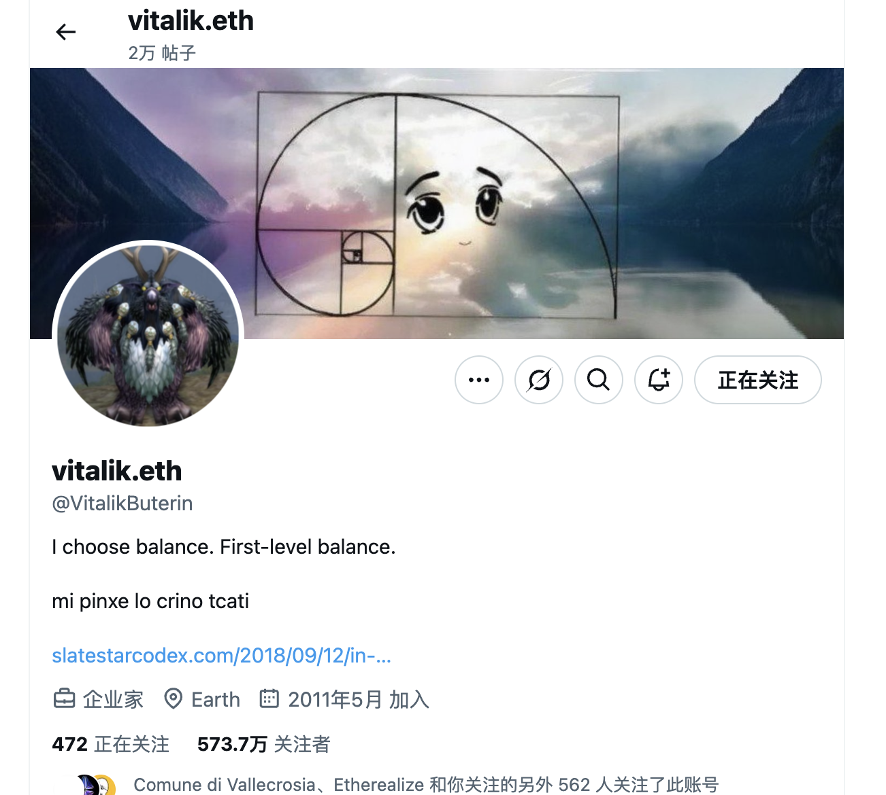

# 加密货币投资周刊 第14期

_本文写于2025年3月2日下午_

过于乐观失足后如何调整策略/以太坊生态终于有市场部了!

大家好，我是FatBro - 一位专注于让钱包变胖的资深投资者，这是我的第14期加密货币投资周刊。

市场确实是多变的，灰犀牛和黑天鹅最终还是发生了。本周市场大幅下挫，BTC最低跌至78000美元左右，ETH最低跌至2070美元，市场恐慌指数也最低下探至极度恐惧的10附近。
本轮下跌的灰犀牛我认为有两个：

一是市场对特朗普的胜选过于乐观，以至于上任后的一系列政策和行为不及预期的情况是的市场出现了大幅的回调
二是市场对美联储的降息过于乐观，市场对2025年的降息节奏对市场的流动性产生了忧虑

黑天鹅当然是最近Bybit被盗事件，黑客较为顺利的洗币，以及Safe的前端被攻破使得机构资金恐慌，也间接导致市场出现了大幅的回调。

当前的市场，投资者大致有几种情况，一种是前期判断到会有一波下跌，保持了不错的法币仓位，那么当前的下跌对他们来说就是好事，可以重新逐步建仓，Buy the Dip。而更多的投资者情况也许是很多对于牛市预期很高的投资者此时此刻已经没有子弹了，而几乎在满仓的情况下承受着浮亏的压力。
我的情况介于两者之间，还留有一部分的法币，但是仓位还是比较满的，但是一直秉承着不做投机性杠杆的策略原则，所以当前的浮亏主要是持有一些头部价值项目的现货产生的，那么鉴于这种情况我会如何调整策略呢？

### 策略调整

#### 进行一次坦诚的调仓

在市场下挫后，因为是非理性的下跌，一些长期看好的项目也出现了大幅的回调，如ETH，LDO，PENDLE这些属于明显被低估的项目。那么此时此刻，我需要进行一次坦诚的调仓，将持有的一些短期投机性项目的代币换成这些长期看好的项目，减少币种持有的品类，因为在市场流动性缺乏的情况下，在相似的FDV的情况下，长期有价值的项目抗跌性会更强，尽量去置换正好在代币大量释放周期但业务没有什么进展的项目，因为这类项目在牛市中可以被炒作，但是一旦市场回调，这类项目会因为缺乏业务进展而出现大幅的回调。并且，这样的调仓在心态上也是容易接受的，只是把一种浮亏转换到另外的代币浮亏上去，你仍然有很大的机会会在反弹中获得获利的机会。

#### 币生币机会的挖掘

很多代币都有很不错的生息机会，市场好的时候因为希望代币保持流动性，所以一般不会去选择质押太多，但是当行情回撤较大的时候，用已有的代币去赚取更多的代币是一种不错的选择,可以在无聊的盘整期间赚取更多的代币。特别是当这个项目又是你长期看好的项目，那么这样的机会就更加值得去把握。

本周周中，我其实在我的推特上分享了几个这样的机会, 接下去举几个例子：

##### 举例一
比如我利用ZK/ETH的 LP 生息机会，已经在短短的一个月时间里面用10w美元本金赚取了60000枚ZK代币了, 按照60%的年化率，如果这样的行情持续半年，我也可以获得本金的30%收益，也就是多持有了至少30%的ZK代币，使得我的ZK仓位获利的可能性大大增强，详细策略请查阅: https://x.com/FatbroCN/status/1894964157059108914

顺便提提ZK，我觉得团队的商业运作能力其实是非常强的，最近比较火的消费链基本都采用了ZK elastic作为底层，同时在EthDenver也大放异彩，如胖企鹅发的Abstract, AAVE生态的Lens，TreasureDAO/Magic生态的Treasure, Crypto.com的Cronos，可见ZKSYNC团队的BD能力和技术框架被接受度还是非常强的。当前在ZKEVM STACK赛道是遥遥领先其他生态的。

##### 举例二
我也将我一部分的Pendle仓位质押成了6个月解锁期的vePendle，预估年化率应该在15%+左右和额外的一些空投机会。虽然在Pendle界面可能你会看到如下每个月的年化收益率是50%+，但是这是vePendle的收益，实际上你只有选择2年以上的锁仓才能够或得到满权重的vePendle，我建议大家选择6个月或者12个月就差不多了。你也可以通过下图感受1月份的vePendle的收益情况，排名第一的用2993个vePendle获得了0.3546ETH，当然他是第一名。那么我就可以用我那用20000多枚Pendle锁定6个月生成的4816个vePendle去预估收益了。

##### 举例三
当然针对那些官方没有额外激励你又看好的项目，网格仍然是一个可以选择的策略。比如LDO。 网格策略会使用去中心化交易所DeGate进行交易,[https://degate.com](https://degate.com/?utm_source=fatbrozh_14),如下图，虽然现在完全出格，但是历史上LDO的网格已经给我创造了差不多1w美元的收入，实际上相当于本金的1/3了，所以选择不断抄底同时网格的策略可以有效的降低平均持仓成本。

## 几个以太坊的动态
本周以太坊确立了新的基金会执行的团队， Hsiao-Wei Wang 和 Tomasz Stanczak作为以太坊基金会的联合执行官，负责以太坊基金会的日常运营。
https://x.com/ethereumfndn/status/1895851576251826227

值得注意的是，Tomasz Stanczak上任伊始就放出了他个人Calendlly Link，以十分开发积极的心态与社区进行着交流。

与此同时，一个叫EF Silviculture Society的协会也成立了，这是一个由基金会外部松散个人组成的组织，给以太坊基金会提供非正式的建议，使得组织更加开发的获得这个森林里的信息。

最让人惊喜和期待的其实是，曾经为以太坊作出杰出贡献的DannyRyan。他前不久刚刚退出以太坊基金会，引起了大家的负面情绪，他现在以Etherealize Co-founder的角色火速回到了以太坊生态，我仔细调研了一下这个组织，看到这个组织的愿景是 Connecting Institutions to the Ethereum Ecosystem。
终于，以太坊这个去中心化程度最高的基础设施，终于有市场部了！那些犹豫不决的机构场景建设者，在选择区块链生态时，曾因以太坊缺乏高效的机构服务而转向其他链，尽管后者在安全性和去中心化程度上略显不足。如今，这些机构终于可以毫无顾虑地选择以太坊生态，获得既有专业服务又不牺牲核心价值的完美体验。

还有一个有意思的事情，昨天是华人农历2月2日，是华人传统的龙抬头的日子，Vitalik又换头像了！上一次用Milady改天换面，这一次用了一个魔兽世界的生物，并附加了新的Twitter描述，大家觉得是什么寓意呢？

## 后市期许
我认为MEME赛道很可能告一段落，市场很难产生比Trump预期更大的刺激和赚钱效应了，但是市场依然会去寻找下一个热点，希望社区能够更快找到能够推动行业发展的叙事和应用场景。

### 社群交流
欢迎关注我们的社群,与其他投资者交流经验:
- 电报群: [https://t.me/FatBroCN](https://t.me/FatBroCN)
- 推特: [https://x.com/FatbroCN](https://x.com/FatbroCN)

免责声明：本人不是专业的理财顾问。以上内容仅代表个人观点和经验分享，不构成任何投资建议。投资有风险，入市需谨慎。所有投资决策请根据自身情况独立判断，风险自负
