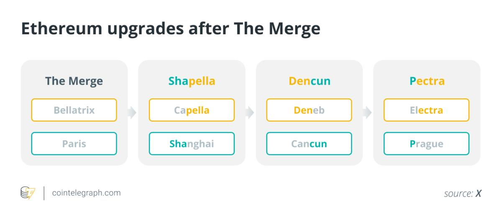

# 加密货币投资周刊 第15期

_本文写于2025年3月9日下午_
【专题】透过利好哪些应用和场景，通俗浅析以太坊Pectra升级

大家好，我是FatBro - 一位专注于让钱包变胖的资深投资者，这是我的第15期加密货币投资周刊。

本周虽然有一些事发生，特朗普签署比特币储备行政命令和白宫召开加密峰会，但似乎市场并没有什么大的波澜，我看到已经有很多文章在深层次的分析这个政策的短期和长期影响，有人说特朗普戏耍了所有人，有人说这就是特朗普能够把这件事往前推进的最佳路径，我想我就不用去再剖析描述了，慢慢让时间来阐明真相吧。

本期周刊，我想来做一个关于以太坊Pectra升级的专题内容，希望以更浅显的方式来让大家了解这个升级和对于具体项目和市场的潜在影响。

## 什么是Pectra升级？

Pectra升级是以太坊网络的一次重要协议升级，计划于2025年4月在主网上线。它是以太坊在合并（The Merge，2022年9月）和Dencun升级（2024年3月）之后又一个关键里程碑，旨在进一步提升网络的可扩展性、安全性和用户体验。

### 为什么命名为Pectra？
以太坊的升级，每次都会伴随着有意思的名字，比如早期的家园，拜占庭，君士坦丁堡这些以历史，特别是The Merge以后，以太坊的升级就有一些有意思的规律了，具体如下图：

因为从以太坊PoW转PoS的The Merge以后，以太坊每次升级实际上变成了两部分，一部分叫共识层，另一部分叫执行层，简单理解就是共识层管理的是几十万个节点的协作来维持这个网络的安全和正确，执行层就像一个计算机，开发者和用户可以在上面开发和运行各种去中心化应用。

所以说以太坊核心开发者生态里面有两拨人，一拨人在做共识层，一拨人在做执行层。他们又分别给自己开发的每一次大版本都命名，但是每次升级最好大家能够一起执行，因为很多的工作大家都是要协作才能达到一些共同目标的，所以往往每次milestone都会将共识层和执行层的词根合并到一起，为了所有人都更好地记忆，方便传播。还可以看到一个有趣的现象，执行层的名称是城市名(都是曾经办过Devcon的城市哦)，而共识层是一些宇宙中的恒星(特别是闪亮的恒星)。所以，这次Pectra实际上就是布拉格(Prague)和昴宿一[（Electra）](https://en.wikipedia.org/wiki/Electra_(star))的结合。上一次的Dencun升级，就是坎昆(Cancun)和天鹅座天津4[(Deneb)](https://en.wikipedia.org/wiki/Deneb)的结合。

### 这次升级内容和重点是什么？

这次升级一共包含11个EIP

| EIP 标题                                           | 通俗解释                                                   | 利好项目方 ｜
|--------------------------------------------------|------------------------------------------|------------------------------------------|
| **EIP-2537**: Precompile for BLS12-381 curve operations | 增加内置的"高级计算器"，快速完成复杂加密计算。例如：就像给计算机安装了专用芯片，让验证ZK证明的速度提升10倍。 这个计算器安装呢特别友好ZK Rollup的证明生成和验证，以太坊验证者的聚合签名效率，智能合约钱包的开发者去聚合签名，以及一些用轻客户端的互操作性方案的项目。曾经很多因为以太坊签名贵的一些被搁置的方案和应用接下去就可以做了 | Rollup类: zkSync, Taiko, Starknet, Scroll, DeGate, Arbiturm, Optimism，Base 等   聚合签名/验证类: Safe Wallet，Lido, RocketPool 等    轻客户端类: 比如Cosmos-Ethereum IBC桥，Polkadot-Ethereum Bridge, LayerZero, Wormhole 等 |
| **EIP-2935**: Save historical block hashes in state | 让以太坊记住更长的历史区块数据（从约1小时增加至约27小时）。例如：应用可以查询一天前的区块信息，而不仅仅是最近一小时的。  通俗解释下，先说什么是有状态，我要在银行里面支付1000快钱，那么作为银行，它其实维护了一个很大的帐本是记录和维护当前的所有在银行开户的人的户口号和当前的余额，那么当我支付的时候银行才可以帮我执行和记账。回到无状态的情况，每次你花钱的时候，只需要出示一张由您签名的凭证，上面写明了当前的余额和交易金额。银行只需验证凭证的真实性和完整性，而不需要保留每个人的余额记录。那么如果你上次给银行凭证的时间发生在在8192块的时间里面，那么你上次的操作银行还记着，没有删，你只要给这次新的凭证就行，那么超出的话，也没关系，你把你把开户之后所有以前的凭证都拿过来给我看一下也能操作。| 长远对以太坊本身吞吐量和去中心化程度发展很重要，短期对Rollups和跨链应用开发体验增强 |
| **EIP-6110**: Supply validator deposits on chain | 新验证者质押存款更快到账（从约10小时缩短到13分钟）。例如：小明决定成为验证者并质押32 ETH，现在只需等待一顿饭的时间而不是一整天。 | Lido，RocketPool，Staked-ETF等
| **EIP-7002**: Execution layer triggerable exits | 允许在执行层触发质押退出，更方便。例如：验证者可以通过智能合约设置条件自动退出，而不需要手动操作特殊命令。 通俗点讲就是，质押者可以用Metamask操作做签名提取质押了,核心是更方便了。还有一些更有趣的场景，比如现在很多质押服务商都有帮助用户建立自己的质押服务的能力，也就是他们帮你搭节点，你把节点的验证KEY给服务商，只有服务商能做出块/退回资金这类的操作，理论上只要节点服务商不主动做恶（损人不利己的双花行为），那么资金是安全的。那么如果你没有备份这个KEY或者丢失了，那么只能祈求这个服务商听你的话帮你主动做退出操作了取回来了，不然他就可以勒索你，给点小费才帮你做，那么7002的到来，就可以掌握主动权了，可以直接从执行层用你的收款地址签名就可以退出了。整体上这个升级有助于用户更愿意托管他们的ETH给服务商，也能使得一些节点服务商创建出更加trustless的服务 | Lido，RocketPool，Staked-ETF等
| **EIP-7251**: Increase the MAX_EFFECTIVE_BALANCE | 验证者有效余额上限从32 ETH提高到2048 ETH。例如：机构可以用一个验证者节点管理相当于64个普通验证者的资金，大幅降低运维成本。那么LST和LRT项目方，SOLO大户服务商操作起来更容易了 |EigenLayer, Lido，RocketPool，Staked-ETF
| **EIP-7549**: Move committee index outside Attestation | 优化验证者投票数据，简化投票消息。  简单讲就是提高性能了，CPU节省了，同时也增强了以太坊网络的鲁棒性 | 以太坊本身，Lido，RocketPool, Staked-ETF等
| **EIP-7623**: Increase calldata cost | 提高链上交易附带数据的成本，鼓励采用更高效的数据存储方案（Blob）。例如：发送大量数据的应用将支付更高费用，促使他们迁移到更经济的Blob存储。 简单讲就是提升的Blob的容量后鼓励大家多用Blob少用Calldate | 利好以太坊本身，指导下的优化区块的数据构成，短期不一定利好Rollups，因为有些Rollups是不得不消耗一部分Calldata的 |
| **EIP-7685**: General purpose execution layer requests | 执行层与共识层的沟通变得更灵活方便。例如：就像两个部门之间建立了更高效的沟通渠道，可以处理更多类型的请求和信息交换。 这部分详见[Alexhook的X帖子](https://x.com/alexhooketh/thread/1825830847498375267)| Lido，RocketPool, Staked-ETF等
| **EIP-7691**: Blob throughput increase | 提高以太坊处理"大数据包"（Blob）的能力，每区块容量增加50%。例如：Layer2解决方案可以每12秒提交更多数据到以太坊，使交易成本进一步降低。 利好Layer2，Rollup类项目 | Rollups, Blob消耗量大的项目是Base(至今1430ETH),World Chain(420ETH), Arbitrum(409ETH), Taiko(400ETH), Optimism(247ETH)| 
| **EIP-7702**: Set EOA account code | 钱包账户可以临时执行智能合约代码，实现更强大的智能功能。例如：普通钱包可以一次性执行复杂交易逻辑，无需部署永久合约，节省gas费用。这个升级可能是一个带来应用生态的爆发，使得以太坊用户在不使用智能合约账户的情况下就可以享受Gas代付，打包交易这样的高级功能，打个比方，一个游戏应用就可以直接让用户生成一个7702类型的以太坊地址，然后用户就可以直接开始体验应用了，用户不需要任何Gas，然后用户这个账户不像合约账户那样是这个应用专属，和其他应用不兼容，用户还可以讲这个账户导入到其他标准的钱包里面去进行资产管理。EOA账户有着比智能合约账户更优的费率和更好的生态兼容性 | 以太坊本身 钱包开发商: Metamask, OKX Wallet 意图服务提供商  应用开发者
| **EIP-7840**: Add blob schedule to EL config files | 允许更方便地调整Blob容量，无需频繁升级网络。例如：网络可以根据需求自动调整数据容量，就像云服务器可以根据流量自动扩容。 | 使用Blob的Rollups

## 总结一下

这次以太坊的升级，我觉得主要还是四个类型的内容,提升以太坊长期的安全性和吞吐量，提升用户体验，提升质押体验和安全性，以及加强Layer2的建设。

可以看到，这次升级有一部分EIP是对一些先前留下的缺陷的进一步优化，使得基础设施更加适应实际业务的发展， 如Lido, RocketPool的代理质押业务在这次升级后得到了一个完整的Trustless闭环，我相信也为这些协议服务未来的Staked-ETF打下了很好的基础。

另外我们看到，以太坊支持Layer2的战略走的很坚决，虽然我个人认为短期会继续让代币经济模型承压，但是长期来看，以太坊的生态会因为Layer2的建设而更加繁荣，从而带动以太坊本身的发展。

EIP-7702的升级，我个人认为是一个非常值得期待的升级，也许预示着用户门槛进一步降低和应用生态的进一步繁荣。

对于投资的机会，虽然没有实质性的经济模型变化和直接利益，但是又一些会因为升级有热点的覆盖，也许ETH本身，LDO，RPL在升级完成后会有一些表现，也可以关注一些头部的Layer2，特别是在升级后他们Blob数据消耗的成本变化。

期待4月，以太坊Pectra升级正式上线。

### 社群交流
欢迎关注我们的社群,与其他投资者交流经验:
- 电报群: [https://t.me/FatBroCN](https://t.me/FatBroCN)
- 推特: [https://x.com/FatbroCN](https://x.com/FatbroCN)

### 工具选择
网格策略会使用去中心化交易所DeGate进行交易,[https://degate.com](https://degate.com/?utm_source=fatbrozh_15)

免责声明：本人不是专业的理财顾问。以上内容仅代表个人观点和经验分享，不构成任何投资建议。投资有风险，入市需谨慎。所有投资决策请根据自身情况独立判断，风险自负
