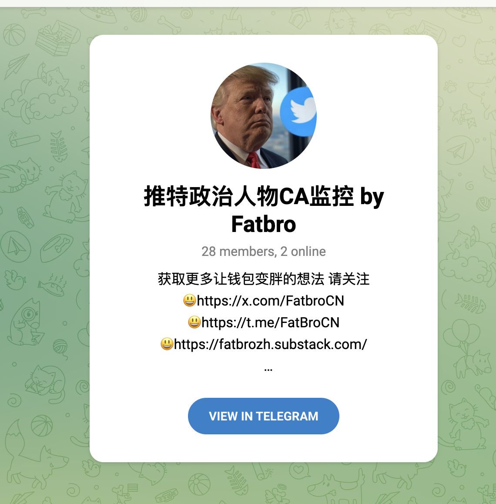
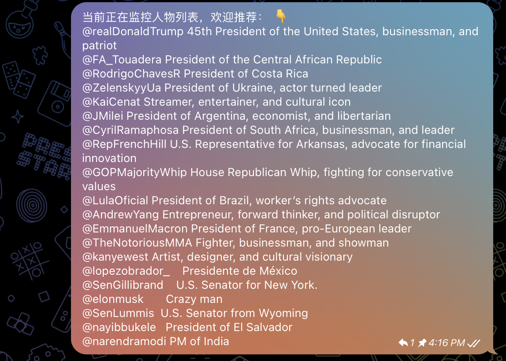
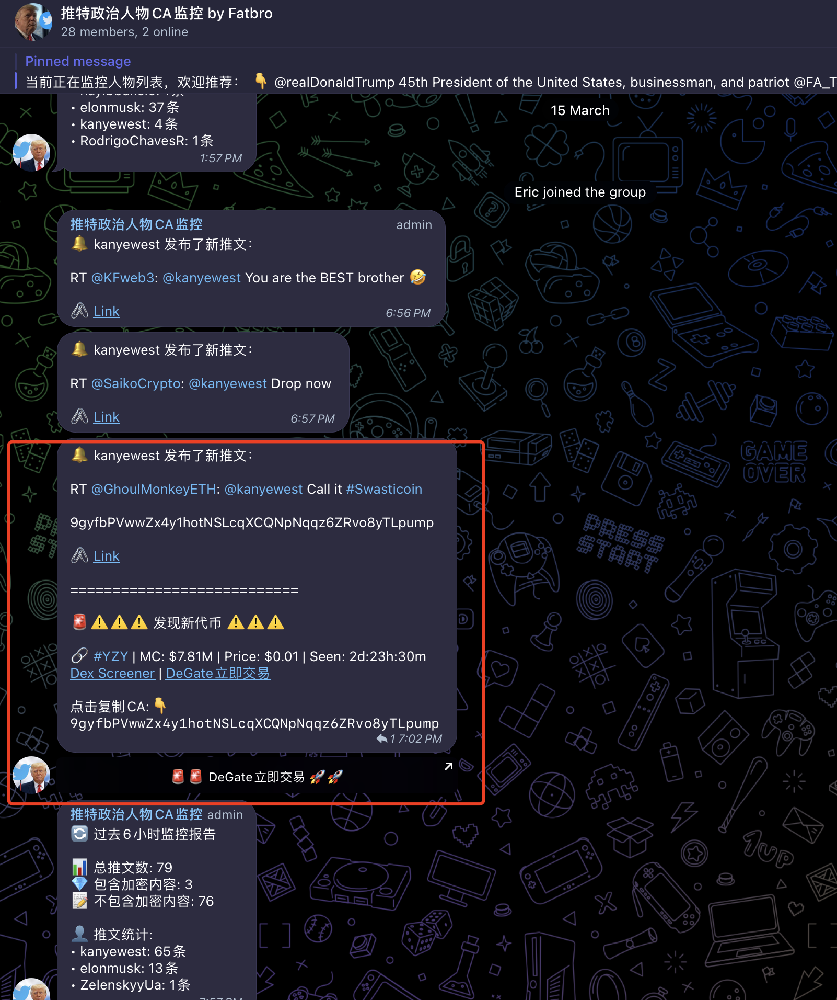

# 加密货币投资周刊 第16期

_本文写于2025年3月16日下午_

重磅发布，新币发现神器 | 撸毛进入Ai Agent时代，会怎么进化行业？大家好，我是FatBro - 一位专注于让钱包变胖的资深投资者，这是我的第16期加密货币投资周刊。

本周的市场继续波澜不惊，主要的币种都没有太大的波动。市场正在不断叠加的各种不确定性中向前走，不过好的消息是从稳定币总量的角度看，我们确实没有进入熊市，只是整体对当前的国际局势，特别是美国的政策走向有一些恐慌和缺乏信心，那么依旧让我们静待市场的发展，在这一阶段我还是继续做一些稳定性收益的，并趁着行情的冷静期继续研究学习，提升认知，推动一些自己想做的事。

### Fatbro AI Agent走出了第一步

本期的重点话题还是延续自[第7期](../episode7/加密货币投资周刊%20第7期.md)的想法，那么有想法就要行动，就在最近，我完成了一个自动发现政治人物twitter发币机会监控的机器人。所谓Fatbro AI Agent Roadmap中的第一步，那就先兼听则明，先装上一些眼睛！主要抱着玩一玩的心态，同时锻炼下自己多年荒废的编码能力(实际上现在已经不用我动手了，动口让AI干就行）。

不过我选择这个主题也是有一定逻辑，自从川普发币之后把MEME赛道推向了最高潮，使得后续的大多数日常的关键词和事件类MEME都不能持续，也许这个赛道结束了，但是川普发币给名人币也许能够带来更多的启发和政策的解放，我甚至期待有些名人不以发MEME的方式来发行自己的代币可能带来一些新的热点和玩法。那么不管怎么样，先监控起来。

目前，Fatbro已经正式上线了Twitter政治人物 SOLANA CA监控，只要监控的账号发送了符合SOLANA CA的字符串或者提及Crypto相关的词汇，就会推送到这个Bot。并且附带去Dex购买链接。

欢迎大家尝试体验，点击以下链接机器人加入telegram群，也可以和群友在机会发生时做交流（因为有时候名人也不靠谱，比如我就在测试的期间上了米莱的当）：
https://t.me/fatbro_twitter_political_bot

当前监控的人物如下图，：

正好，昨天坎爷RT了一个CA被监控抓住了发在群里，但是现在已经删除了twitter，还是不靠谱吧。不过大家可以看到Bot监控机会之后Bot告警的样子：

挺有意思吧，也希望大家贡献更多你希望监控可能发币的政治人物或者明星！直接在群里留言就可以了，我就会添加进去，让我们集思广益，一起发现Alpha！

### 关于Ai Agent的新认知

今天我也想更进一步描述下我对实现一个投资型的Ai Agent的更进一步的想法。当前实际上在AI Agent的是现实上，数据的获取，大模型的推理决策基本上是没有大问题的，但是最大的问题实际上是安全性，当你想让一个AI帮你管钱的时候你就要保证AI会在你预设的框架中去执行，不会因为某些bug导致策略外的资金损失，甚至像人一样，AI也会受到外部的黑客攻击，篡改了你AI的执行逻辑，导致AI主动的把你的资金转给他人。针对这些安全问题，有很多的措施，针对和Web行业相关的几个点我做了一些学习：

- 首先是上周文章([第15期](../episode15/加密货币投资周刊%20第15期.md))中提到的以太坊Pectra升级中包含的EIP7702可以很好的帮助AI拥有一个EOA的以太坊地址的私钥，并且这个地址可以被像合约一样受到限制，比如每24小时投资多少金额，只能操作拿哪一些协议，这样会使得AI Agent在资产管理的快速实现和发展路径上更安全。比如我可以只允许某一个AiAgent每天只能投资500美元，或者只能在AAVE，Compound两个协议中做操作。

- 还有的就是TEE（可信执行环境）也能帮助AI的安全。TEE是一种特殊的计算环境，它能够保证代码和数据的机密性和完整性。对于AI Agent来说，TEE可以提供以下几个关键保障：
  1. **私钥保护**：AI Agent的私钥可以存储在TEE的Enclave中，私钥不会轻易的泄露。这对于管理加密资产至关重要。
  2. **代码完整性**：TEE可以确保AI Agent的执行代码没有被篡改，防止黑客注入恶意代码导致资金被盗。
  3. **数据隐私**：投资策略、交易历史等敏感数据可以在TEE中处理，避免被未授权方获取。
  4. **远程认证**：用户可以通过TEE的远程认证机制验证AI Agent是否运行在真正的TEE环境中，增强信任度。

  目前，像Intel SGX、ARM TrustZone、AMD SEV等都是市场上常见的TEE实现。在Web3领域，已经有一些项目开始利用TEE来构建更安全的基础设施，对于AI投资代理来说，结合TEE和区块链技术，可以打造一个既智能又安全的资产管理系统。

- 另外，我想多签（Multi-signature）机制也是一种在某些大额场景下值得考虑的安全措施。我们可以设计一个系统，要求重大投资决策必须由AI Agent和人类共同签名才能执行，这样既发挥了AI的分析能力，又保留了人类的最终控制权。

### 展望未来和我的下一步AI之旅

过去的几周我又看到了Ai领域的飞速发展，比如看到了Manus的Demo，也看到了撸毛工作室用AI控制了百个手机去完成Twitter任务，话说Monad测试网的账户数已经有1440万，话说有多少是AI是个问号，我想也许现在的项目方已经很难判断出哪个是人哪个是AI了，因为AI Agent就是我的化身，多开一个就是我的分身，这样的变化也许会导致项目方代币分发策略的转变，也许那些能识别真人的DID验证会变成必备选项；也许项目放的维度更加会按照实际真实支出和收入，而不是交互；也许项目方也会诞生出更聪明的AI去识别AI，一切又变得更加有趣了。

期待4月份以太坊Pectra升级中的EIP7702，我会在发布后继续我的Fatbro Ai Agent之旅，希望给大家尽快呈现第一个有趣的实战Case。

### 社群交流
欢迎关注我们的社群，与其他投资者交流经验:
- 电报群: [https://t.me/FatBroCN](https://t.me/FatBroCN)
- 推特: [https://x.com/FatbroCN](https://x.com/FatbroCN)

### 工具选择
网格策略会使用去中心化交易所DeGate进行交易，[https://degate.com](https://degate.com/?utm_source=fatbrozh_16)

免责声明：本人不是专业的理财顾问。以上内容仅代表个人观点和经验分享，不构成任何投资建议。投资有风险，入市需谨慎。所有投资决策请根据自身情况独立判断，风险自负。 