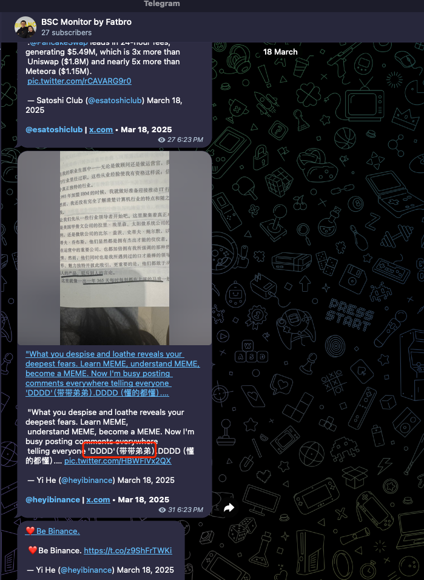
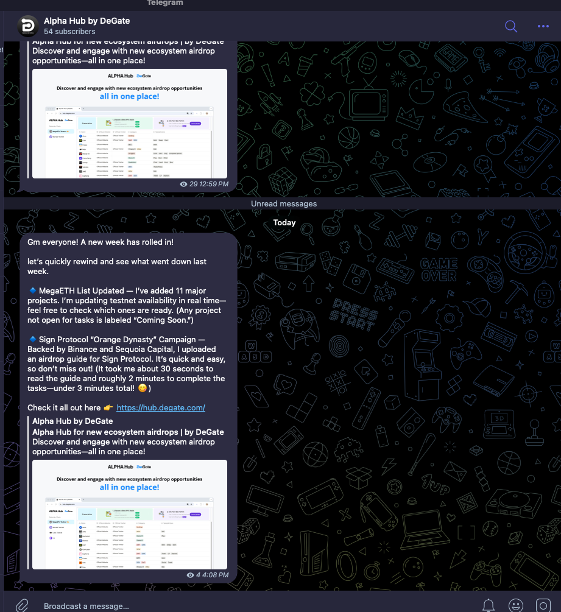

# 加密货币投资周刊 第17期

_本文写于2025年3月24日下午_

大家好，我是FatBro - 一位专注于让钱包变胖的资深投资者，这是我的第17期加密货币投资周刊。

本周的市场有了一些相对积极变化，市场很多声音认为美联储会在4月1日结束缩表，即QT。这也意味着短期会为市场重新注入流动性。同时之前成功预测行情大幅调整的Arthur Hayes也在今日发推表示市场正在从QT转向QE，BTC会重新触达11万后回调至7.65万，这也为接下去反弹行情注入了积极的信号。不过，关税政策，战争的不确定性依旧弥漫着整个市场，在这种情况下，我认为当前很值得去抓一波前期超跌价值代币的反弹，目标20%收益即止盈离场。

本周另外一个有趣的变化是BSC生态似乎接管了市场的热度，诞生了一些热门的MEME，随着OKX wallet因为欧洲合规问题暂时下线了Swap功能，币安Wallet也趁机加大获客力度，CZ也亲自上阵为BSC生态喊单。我也尝试制作了一个BSC生态的Telegram机器人，目前只监控了CZ和heyi两个人的推特内容，可以帮助大家寻找投机MEME的角度。举个例子，那天我第一时间发现了$DDDD这个机会，就去dexscreener买了两个叫DDDD的币，最后小赚了250%的猪脚饭，现在测试版本有几分钟的延迟，但是稍微还是有些价值的。

这周开始我应该会再探索发现一下BSC上的机会，再多做一些实用工具，帮助大家更容易的来找到Alpha。

### 空投机会分享
继Monad测试网几周后，本周MegaETH的测试网正式上线，我体验了几个交易确实感受到了实时区块链的魅力，大家可以体验下。
虽然官方说测试网的交互式没有空投的，但是我认为上面的项目方也许对于测试网的早期交互是有空投的，况且可以通过测试网的交互熟悉生态应用，了解早期参与这个生态的更多机会。这里推荐一个很好的页面给大家 [DeGate Alpha Hub](https://hub.degate.com/megaeth-testnet),可以通过水龙头每天领取测试币。 
同时也推荐订阅这个Telegram bot [https://t.me/alphahub_degate](https://t.me/alphahub_degate), 我终于找到一个信息不过载的的方式撸空投了，别的空投平台要么项目太杂，撸的蚊子肉，没有长期价值，DeGate这个Alpha Hub选择的项目比较克制，都是有潜力值得花一些时间的项目。

### 我抄底了什么
开篇说了，我会去抓一个20%的止盈的反弹，那么我抄底了什么，稍微分享下，不构成投资建议:
- 第一个是Pendle, 跌到了3以下，我在2.2附近进行建仓，vePendle的收入持续稳定，期待有一波不错的反弹。
- 第二个是ACX，跌的优点多，属于价值超跌品种，昨天上了韩国交易所突然冲到了4毛多又跌回3毛，依然是一个不错的标地。
- 第三个还是ETH，对1900我加仓了，放水预期，2000开始反弹到2400，我这不算过分吧。

### 社群交流
欢迎关注我们的社群，与其他投资者交流经验:
- 电报群: [https://t.me/FatBroCN](https://t.me/FatBroCN)
- 推特: [https://x.com/FatbroCN](https://x.com/FatbroCN)

### Fatbro AI 工具
一些FatBro AI路径上实现了的工具，欢迎大家使用：
- Twitter政治任务发币CA监控: [https://t.me/fatbro_twitter_political_bot](https://t.me/fatbro_twitter_political_bot)
- BSC热点监控: [https://t.me/bsc_cz_heyi_monitor_by_fatbro](https://t.me/bsc_cz_heyi_monitor_by_fatbro)

### 工具选择
- 网格策略会使用去中心化交易所DeGate进行交易，[https://degate.com](https://degate.com/?utm_source=fatbrozh_17)
- 信息不过载的撸空投信息聚合平台,每天可以领取测试币 [https://hub.degate.com/](https://hub.degate.com/)

免责声明：本人不是专业的理财顾问。以上内容仅代表个人观点和经验分享，不构成任何投资建议。投资有风险，入市需谨慎。所有投资决策请根据自身情况独立判断，风险自负。 